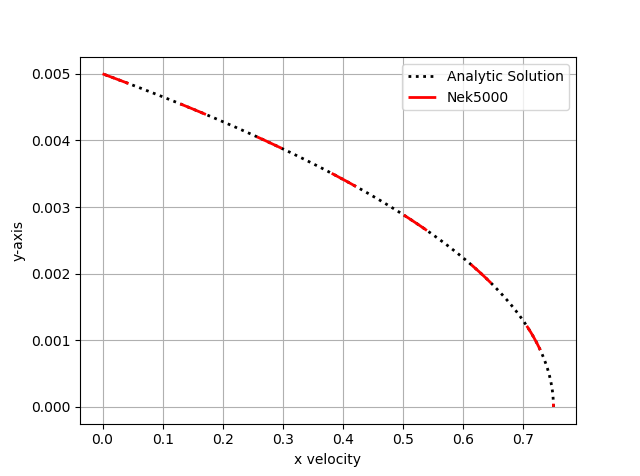

.. _fdlf:

Fully Developed Laminar Flow
============================

In this tutorial we will be building a case that involves incompressible laminar flow in a channel with a constant heat flux applied.
This case uses air as a working fluid and will be simulated using fully dimensional quantities.
A diagram of the case is provided in :numref:`fig:setup` and the necessary case parameters are provided in :numref:`tab:setup`.
Note that round numbers have been selected for the fluid properties and simulation parameters for the sake of simplicity.

.. _fig:setup:

.. figure:: fdlf/setup.png
   :align: center
   :figclass: align-center
   :alt: flow diagram
   :width: 500

   Diagram describing the case setup for fully developed laminar flow in a channel.

.. _tab:setup:

.. csv-table:: Fluid properties and simulation parameters
   :align: center
   :header: "Parameter name","variable","value"
   :widths: 15, 15, 15

   "channel height",":math:`H`","1 cm"
   "channel length",":math:`L`","20 cm"
   "mean velocity",":math:`U_m`","0.5 m/s"
   "heat flux",":math:`q''`","300 W/m\ :sup:`2`"
   "inlet temperature",":math:`T_{in}`","10 C"
   "density",":math:`\rho`","1.2 kg/m\ :sup:`3`"
   "viscosity",":math:`\mu`","0.00002 kg/m-s"
   "thermal conductivity",":math:`\lambda`","0.025 W/m-K"
   "specific heat",":math:`c_p`","1000 J/kg-K"

This case has analytic solutions to the momentum and energy equations which makes it easy to confirm if the problem is setup correctly.
These expressions will be used to test the accuracy of the solution.

.. math::
   :label: fdlf_vel

   u(y) = \frac{3}{2} U_m \left( 1 - 4\left(\frac{y}{H}\right)^2\right)

.. math::
   :label: fdlf_temp

   T(x,y)-T_b(x) = \frac{q'' H}{2\lambda}\left( 3\left(\frac{y}{H}\right)^2 - 2\left(\frac{y}{H}\right)^4-\frac{39}{280}\right)

where the bulk temperature is given by the expression

.. math::

   T_b(x) = \left(\frac{2q''}{U_m \rho c_p H}\right)x + T_{in}

.. Additionally, we will extract the predicted Darcy friction factor and Nusselt number from the simulation and confirm that they match the expected values.

.. .. math::

   f = \frac{96}{Re}

.. .. math::

   Nu = \frac{140}{17}

Before You Begin
________________

This tutorial assumes that you have installed *NekRS* and have setup your `PATH` environment to point to installation directory.
Instructions for installation and setting environment can be found in :ref:`Quickstart guide <quickstart>`.

Before running the case, you will need the mesh generation tool ``genbox``.
These tools are not packaged with *NekRS* but are available with *Nek5000*. 
Please follow the instructions in the :ref:`Building the Nek5000 Tool Scripts <scripts>` section to obtain and build this tool.

Mesh Generation
_______________

This tutorial uses a simple 3D cuboid box mesh generated by ``genbox``. 
To create the input file for ``genbox``, copy the following script and save the file as ``fdlf.box``.

.. literalinclude:: fdlf/fdlf.box
   :language: none

For this mesh we are specifying 50 uniform elements in the stream-wise (:math:`x`) direction, 5 uniform elements in the span-wise (:math:`y`) direction, and 3 uniform element in :math:`z`-direction.

.. note::
    *NekRS* can only solve 3D problems, therefore the mesh has 3 elements in the z-direction with periodic boundary condition.
    At least 3 mesh layers are required to correctly construct the mesh connectivity array in *NekRS*.

The velocity boundary conditions in the x-direction are a standard Dirichlet velocity boundary condition at :math:`x_{min}` and an open boundary condition with zero pressure at :math:`x_{max}`.
In the y-direction the velocity boundary conditions are a symmetric boundary at :math:`y_{min}` and a wall with no slip condition at :math:`y_{max}`.
In the z-direction there is a periodic velocity boundary condition at both :math:`z_{min}` and :math:`z_{max}`.

The temperature boundary conditions in the x-direction are a standard Dirichlet boundary condition at :math:`x_{min}` and an outflow condition with zero gradient at :math:`x_{max}`.
In the y-direction the temperature boundary conditions are an insulated condition with zero gradient at :math:`y_{min}` and a constant heat flux at :math:`y_{max}`.
The z direction boundary conditions are periodic at both :math:`z_{min}` and :math:`z_{max}`.

Note that the boundary conditions specified with lower case letters must have values assigned in relevant functions in the :ref:`udf <udf_functions>` file, which will be shown later in this tutorial (see :ref:`bc_ic_udf`).
Now we can generate the mesh with:

.. code-block:: console

   $ genbox

When prompted provide the input file name, which for this case is ``fdlf.box``.
The tool will produce binary mesh and boundary data file ``box.re2`` which should 
be renamed to ``fdlf.re2``:

.. code-block:: console

   $ mv box.re2 fdlf.re2

.. tip:: 
   If ``genbox`` cannot be located by your shell, check to make sure the ``Nek5000/bin`` directory is in your path.
   For help see `here <https://nek5000.github.io/NekDoc/quickstart.html#sec-path>`_.
   A detailed explaination of the *Nek5000* box format can be found `here <https://nek5000.github.io/NekDoc/tools/genbox.html>`_

.. _fdlf_par:

Control parameters file (.par)
______________________________

The control parameters for any case are given in the :ref:`par <parameter_file>` file.
For this case, create a new file called ``fdlf.par`` with the following:

.. literalinclude:: fdlf/fdlf.par
   :language: ini

The constant fluid and temperature properties, as listed in :numref:`tab:setup` are specified under the ``[FLUID VELOCITY]`` and ``[SCALAR TEMPERATURE]`` sections, respectively.

.. note::
   Any passive scalar being solved for must be assigned a string identifier in ``[GENERAL]`` section, as shown above, using the ``scalars`` key.

``rho`` and ``viscosity`` keys correspond to the fluid density and dynamic viscosity, while the ``transportCoeff`` and ``diffusionCoeff`` corresponds to volumetric heat capacity, :math:`\rho c_p`, and thermal conductivity, :math:`k`, respectively.

The required values for the initial and boundary conditions specified by lower case letters in the  ``.box`` file are defined here as part of the ``[CASEDATA]`` section, as shown above.
This optional section must be explicity identified in ``.par`` file using the ``userSections`` key.
This provides an easy way of passing data to *NekRS* that can later be used throughout the ``.udf`` file where the conditions will later be set.
Additionally, like all values specified in the ``.par`` file, they can be changed without the need to recompile *NekRS*.

The above case is run with a polynomial order of 5 and upto :math:`t=1s`, as specified using ``endTime`` key.
Details on the other keys in the ``.par`` can be found :ref:`here <parameter_file>`.

User-Defined Host Functions File (.udf)
_______________________________________

The user-defined host functions file implements various subroutines, including initial and boundary conditions, to allow the user to interact with the solver.
Get started with creating a new file called ``fdlf.udf`` and defining the following sections:

.. _fdlf_param:

Loading user parameters
^^^^^^^^^^^^^^^^^^^^^^^

Define global variables to store the mean velocity, heat flux, inlet temperature and channel height defined in the ``[CASEDATA]`` section of the ``.par`` file,

.. literalinclude:: fdlf/fdlf.udf
   :language: c++
   :lines: 1-4

The ``static`` keyword in c++ instructs the compiler to make the variable visible and accessible only within the source file where it is defined, in this case ``fdlf.udf`` file.
The values are loaded inside the ``UDF_Setup0`` function as follows,

.. literalinclude:: fdlf/fdlf.udf
   :language: c++
   :lines: 40-46

Three parameters are taken by ``platform->par->extract`` function, viz., the user section name, key defined by user and the variable where the value from ``.par`` file is stored, respectively.

.. note::

   The variables defined in user section in ``.par`` file, in this case ``[CASEDATA]`` section, are case insensitive. 

To also make these variables available in device kernels in :ref:`OKL block <okl_block>`, where boundary conditions are assigned, the ``UDF_LoadKernels`` function is used to define device specific variables as follows,

.. literalinclude:: fdlf/fdlf.udf
   :language: c++
   :lines: 32-38

where ``kernelInfo.define(p_xxxx)`` function declares the device specific variable ``p_xxxx``.

.. note::

   Following *NekRS* source code convention, user specified global device variables should start with ``p_``. 

Initial Conditions
^^^^^^^^^^^^^^^^^^

The initial conditions for the case must be specified in the ``UDF_Setup`` routine.
For this case, we specify them as follows,

.. literalinclude:: fdlf/fdlf.udf
   :language: c++
   :lines: 48-65

``nrs->meshV`` is the pointer that references the mesh object for the ``nrs`` (or fluid) solver. 
``U`` and ``temp`` are temporary dynamically allocated arrays on host, used to store the initial conditions.
``mesh->ndim`` is the number of spatial dimensions (always equal to 3) and ``nrs->fluid->fieldOffset`` equals the number of local :term:`GLL` points on an MPI rank.
Thus, ``mesh->ndim * nrs->fluid->fieldOffset`` specifies the total size of ``U`` array to store the three velocity components for all GLL points on an MPI rank. 
``nrs->meshV->Nlocal`` is the total number of :term:`GLL` points in the mesh local to an MPI rank.

.. note::

  For this case, ``mesh->Nlocal`` and ``nrs->fluid->fieldOffset`` are equal.
  This may not be true for other problems, such as :ref:`conjugate heat transfer <conjugate_heat_transfer>`

The for loop block shown above loops over all GLL points (``mesh->Nlocal``) and specifies unfiform ``umean`` value to the x-component of velocity, zero to y,z components and ``tinlet`` value to the temperature array.
Note how ``nrs->fluid->fieldOffset`` is used to navigate to the array location corresponding to x,y,z components of velocity.

.. warning::

  The initial conditions must be specified inside the ``if`` condition block which checks if ``RESTART FILE NAME`` is empty.
  In the event that the case is being restarted from a checkpoint file, this ensures that initial conditions that are read from the checkpoint file are not over-written

Finally, the data from host arrays ``U`` and ``temp`` are copied onto the device arrays ``nrs->fluid->o_U`` and ``nrs->scalar->o_solution("temperature")`` using the ``copyFrom`` function.
Note that the location of the scalar array in ``nrs->scalar`` object is idenitifed using the ``temperature`` string, which is defined in the ``.par`` file using ``scalars`` key.

.. _bc_ic_udf:

Boundary Conditions
^^^^^^^^^^^^^^^^^^^

The boundary conditions in *NekRS* are specified in the :ref:`OKL block <okl_block>` using the ``udfDirichlet`` and ``udfNeumann`` kernel functions.
The velocity and temperature are set to the analytic profiles given by Eqs. :eq:`fdlf_vel` and :eq:`fdlf_temp`, respectively, at the inlet as follows,

.. literalinclude:: fdlf/fdlf.udf
   :language: c++
   :lines: 8-21

The ``udfDirichlet`` device function is called from the internal *NekRS* routines.
The ``bcData`` is an internally defined ``struct`` which contains useful variables local to the specific boundary :term:`GLL` point.

.. note::

  The boundary condition routines ``udfDirichlet`` and ``udfNeumann`` are called for every GLL point by the *NekRS* solver.
  For a list of all variables available through the ``bcData`` struct see :ref:`here <bcdata>`.

The ``isField`` function is used to identify the particular governing equation being currently solved. 
``"fluid velocity"`` is the string identifier for the velocity solver, while ``"scalar xxxx"`` is the string identifier for the scalar equation, where ``xxxx`` corresponds to the scalar string identifier specified in the ``.par`` file, as shown in the :ref:`previous section <fdlf_par>`, which is ``temperature`` in this case.

``bc->uxFluid`` is the x-component of velocity, at the current :term:`GLL`, which is assigned value as in :eq:`fdlf_vel`.
``bc->sScalar`` is the value of temperature at current :term:`GLL`, set as defined in :eq:`fdlf_temp`, while `bc->y` is the y-coordinate of the location.
Variables with the name ``p_xxxx`` in the above code snippet are the user defined device specific variables, as discussed :ref:`here <fdlf_param>`. 

Flux boundary condition for temperatures is specified in ``udfNeumann`` device function as follows,

.. literalinclude:: fdlf/fdlf.udf
   :language: c++
   :lines: 23-28

``bc->fluxScalar`` variable holds the value of the Neumann boundary condition for the scalar, in this case heat flux.

.. warning::

   The device functions/kernels must be enclosed in ``#ifdef __okl__ ... #endif`` block in ``.udf`` file.
   See :ref:`OKL block <okl_block>` for further details.

Execute Step Routine
^^^^^^^^^^^^^^^^^^^^

The remaining mandatory routine in ``.udf`` file is ``UDF_ExecuteStep``.
This routine is called at the end of every time step in *NekRS* and can be used to perform any post-processing operations.
It is left empty for this case.

.. literalinclude:: fdlf/fdlf.udf
   :language: c++
   :lines: 67-69

For more information on the ``.udf`` file and the available subroutines see :ref:`here <udf_functions>`.

.. _exact_sol_udf:

Running the case
________________

You should now be all set to run your case! As a final check, you should have the following files in your case folder

 * :download:`fdlf.re2 <fdlf/fdlf.re2>`
 * :download:`fdlf.par <fdlf/fdlf.par>`
 * :download:`fdlf.udf <fdlf/fdlf.udf>`

If for some reason you encountered an insurmountable error and were unable to generate any of the required files, you may use the provided links to download them. 
Now you can run the case.

.. code-block:: console

   $ nrsbmpi fdlf 4

The above command will launch an MPI jobs on your local machine using 4 ranks.
The output will be redirected to ``logfile``.

Post-processing the results
___________________________

.. TODO tidy how to get visnek

Once execution is completed your directory should now contain 5 checkpoint files that look like this:

.. code-block:: none

   fdlf0.f00000
   fdlf0.f00001
   ...

and a file named ``fdlf.nek5000`` which can be recognized in Visit/ParaView.
In the viewing window one can visualize the flow-field as depicted in :numref:`fig:velocity_paraview` as well as the temperature profile as depicted in :numref:`fig:temperature_paraview` below.

.. _fig:velocity_paraview:

   Steady-State flow field visualized in Visit/ParaView. Colors represent velocity magnitude.

.. _fig:temperature_paraview:

.. figure:: fdlf/temp.png
   :align: center
   :figclass: align-center

   Temperature profile visualized in Visit/ParaView.

Plots of the velocity and temperature varying along the y-axis as evaluated by *NekRS* compared to the analytic solutions provided by Eqs. :eq:`fdlf_vel` and :eq:`fdlf_temp` respectively are shown below in :numref:`fig:velocity_lineplot` and :numref:`fig:temperature_lineplot`.

.. _fig:velocity_lineplot:

   *Nek5000* velocity solutions plotted against analytical solutions.

.. _fig:temperature_lineplot:

.. figure:: fdlf/temperature_lineplot.png
   :align: center
   :figclass: align-center

   *Nek5000* temperature solutions plotted against analytical solutions.
