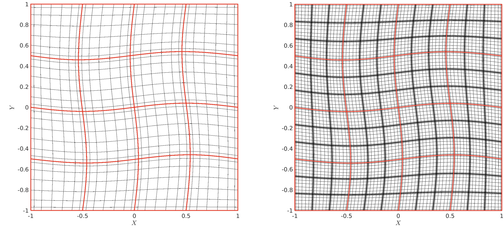

.. _meshing:

Mesh & Meshing
==============

This chapter describes how to configure mesh-related options in *NekRS* and
outlines common workflows for generating, importing, and modifying meshes.
For practical guidance on mesh quality and refinement strategies, see
:ref:`Meshing Tips <meshing_tips>`.

A quick overview:

- :ref:`mesh_setup` to load and modify meshes, boundary tags and connectivity
- Generate simple meshes with :ref:`meshing_nek5000_tools`
- :ref:`meshing_convert` from Gmsh, Exodus II, and CGNS

Related topics:

- :ref:`mesh_moving` setup
- :ref:`meshing_cht` meshes
- On-the-fly :ref:`meshing_hrefine`
- :ref:`Additional meshing tips <meshing_tips>`
- Overview of `mesh_t`

.. _mesh_setup:

Runtime Setup
-------------

Meshes are stored in the binary :ref:`re2 file <re2_file>`, which contains the
coordinates and boundary tags. Several aspects of the mesh can still be
adjusted at runtime in a flexible way.

.. _mesh_setup_coordinates:

Coordinates Modification
^^^^^^^^^^^^^^^^^^^^^^^^

Like *Nek5000*, *NekRS* allows mesh coordinates to be modified at runtime.
Static, one-time deformations are typically applied during initialization in
``usrdat2`` in the ``usr`` file or ``UDF_Setup()`` in the ``.udf`` file.

In principle, any mesh point can be moved arbitrarily, as long as the mapping
remains valid—non-self-intersecting with a positive Jacobian. Below we show
examples of common operations implemented in ``usrdat2`` (in the ``.usr`` file),
including uniform scaling for non-dimensionalization, rotations, and wall-normal
stretching.

.. tabs::

   .. tab:: Uniform scaling (``pb146``)

      In the ``pb146`` example, the mesh is rescaled so that the radius of
      pebbles are scaled from 1.5 to 1.0.

      .. code-block:: fortran

         subroutine usrdat2
         include 'SIZE'
         include 'TOTAL'

         ! rescale to R_pebble = 1
         n     = lx1*ly1*lz1*nelv
         scale = 1.0/1.5
         do i=1,n
           xm1(i,1,1,1) = xm1(i,1,1,1)*scale
           ym1(i,1,1,1) = ym1(i,1,1,1)*scale
           zm1(i,1,1,1) = zm1(i,1,1,1)*scale
         enddo

         return
         end

   .. tab:: Domain rescaling (``tgv``)

      In the ``tgv`` example, the mesh is rescaled to
      :math:`[-\pi,\pi]^3`:

      .. code-block:: fortran

         subroutine usrdat2
         include 'SIZE'
         include 'TOTAL'

         a = -pi
         b =  pi
         call rescale_x(xm1,a,b) ! rescale mesh to [-pi, pi]^3
         call rescale_x(ym1,a,b)
         call rescale_x(zm1,a,b)

         return
         end

   .. tab:: Rotation (``shlChannel``)

      In the ``shlChannel`` example, the domain is rotated by an angle
      ``P_ROT``:

      .. code-block:: fortran

         subroutine usrdat2
         include 'SIZE'
         include 'TOTAL'
         include 'CASEDATA'

         call rescale_x(xm1, 0.0, 1.0)
         call rescale_x(ym1,-1.0, 0.0)
         call rescale_x(zm1, 0.0, 1.0)

         ntot = nx1*ny1*nz1*nelt

         do i=1,ntot
            xpt = xm1(i,1,1,1)
            ypt = ym1(i,1,1,1)

            xm1(i,1,1,1) = xpt * cos(P_ROT) - ypt * sin(P_ROT)
            ym1(i,1,1,1) = xpt * sin(P_ROT) + ypt * cos(P_ROT)
         enddo

         return
         end

   .. tab:: Wall-normal stretching (``ktauChannel``)

      In the ``ktauChannel`` example, wall-normal refinement is introduced
      using a hyperbolic tangent mapping:

      .. code-block:: fortran

         subroutine usrdat2
         include 'SIZE'
         include 'TOTAL'

         parameter(BETAM = 2.8)

         call rescale_x(xm1, 0.0, 8.0)
         call rescale_x(ym1,-1.0, 0.0)
         call rescale_x(zm1, 0.0, 1.0)

         ntot = nx1*ny1*nz1*nelt

         do i=1,ntot
            ym1(i,1,1,1) = tanh(BETAM*ym1(i,1,1,1))/tanh(BETAM)
         enddo

One can apply coordinate transformations in ``UDF_Setup()``, and even
modify the mesh when starting from a restart file (see :ref:`initial_conditions`
for the initialization behavior). In the ``periodicHill`` example below, the
mesh coordinates are first brought to the host with
``auto [x, y, z] = mesh->xyzHost();`` and then copied back to the device via
``mesh->o_x.copyFrom(x.data());`` (and similarly for ``y`` and ``z``).
Alternatively, the :term:`OCCA` device arrays can be modified directly, either
using common utilities such as :ref:`linalg` or a custom kernel.

.. code-block:: cpp

   auto mesh = nrs->meshV;
   auto [x, y, z] = mesh->xyzHost(); // copy to host

   for (int n = 0; n < mesh->Nlocal; n++) {
     x[n] = 0.5 * (sinh(betax * (x[n] - 0.5)) / sinh(betax * 0.5) + 1.0);
     y[n] = 0.5 * (tanh(betay * (2.0 * y[n] - 1.0)) / tanh(betay) + 1.0);

     x[n] = (x[n] - xmin) * xscale;
     y[n] = (y[n] - ymin) * yscale;
     z[n] = (z[n] - zmin) * zscale;

     x[n] = x[n] + amp * shift(x[n], y[n], Lx, Ly, W);

     auto yh = hill_height(x[n], Lx, W, H);
     y[n] = yh + y[n] * (1.0 - yh / Ly);
   }
   mesh->o_x.copyFrom(x.data()); // copy to device
   mesh->o_y.copyFrom(y.data());
   mesh->o_z.copyFrom(z.data());

.. _mesh_setup_sidesets:

Sidesets \& Boundary Tags
^^^^^^^^^^^^^^^^^^^^^^^^^

Correct sideset definitions are essential for applying boundary conditions
properly and for avoiding compile-time errors due to inconsistent boundary
tagging. For a detailed overview of the available boundary condition types,
see :ref:`boundary_conditions`.

**Boundary tags in the .re2 file**

The :ref:`re2 file <re2_file>` stores two kinds of boundary tags for each face:

- A three-character string, which populates the *Nek5000* array
  ``cbc(f,e,ifield)``.
- A numeric ID, which populates ``bc(5,f,e,ifield)`` and is then mapped to
  ``boundaryID(f,e)`` for the fluid domain (and to ``boundaryIDt(f,e)`` when a
  fluid + solid domain is present, e.g., in conjugate heat transfer).

Not all meshes carry both tags. in many cases, only one of them is present.

**Overall logic**

When *NekRS* initializes the mesh:

1. The ``.re2`` file fills both ``cbc`` and ``boundaryID``/``boundaryIDt`` if
   they are present.
2. If ``boundaryID`` is **nonzero**, *NekRS* ignores the ``cbc`` array and uses
   the numeric IDs.
3. If ``boundaryID`` is **zero** everywhere, *NekRS* relies on ``cbc``. You can
   either:

   - run the case using ``cbc`` only, or
   - explicitly convert ``cbc`` to ``boundaryID`` (recommended for clarity and
     for use with the ``.par`` file interface).

.. tip::

   When converting a legacy *Nek5000* case to *NekRS*, the ``cbc`` array
   usually already contains the correct boundary tags. It is still good
   practice to define the mapping in ``usrdat2``, or at least set
   ``boundaryID`` to zero if it is not used, in case the ``re2`` file
   carries non-zero ``bc`` entries.

   Here is a typical mapping from ``cbc`` to ``boundaryID`` (from the ``.usr``
   in the ``pb146`` example):

   .. code-block:: fortran

      subroutine usrdat2
      include 'SIZE'
      include 'TOTAL'

      do iel=1,nelt
      do ifc=1,2*ndim
         if (cbc(ifc,iel,1) .eq. 'v  ') boundaryID(ifc,iel) = 1
         if (cbc(ifc,iel,1) .eq. 'O  ') boundaryID(ifc,iel) = 2
         if (cbc(ifc,iel,1) .eq. 'SYM') boundaryID(ifc,iel) = 3
         if (cbc(ifc,iel,1) .eq. 'W  ') boundaryID(ifc,iel) = 4
      enddo
      enddo

      return
      end

**Using numeric boundaryID**

If ``boundaryID`` is nonzero, *NekRS* ignores the ``cbc`` array and uses the
numeric IDs instead. In this mode, the ``boundaryIDMap`` entries in the
``.par`` file are used to map those IDs to the actual boundary conditions for
each field. A few rules apply:

- Numeric sideset IDs must start at 1 and form a continuous sequence of
  integers with no gaps. If there are gaps (for example,
  ``unique(boundaryID) = 3, 11, 29``), you must remap them to a contiguous
  range using ``boundaryIDMap`` options under ``[MESH]`` in the ``.par`` file:

  .. code-block:: ini

     [MESH]
     boundaryIDMap      = 11, 3, 29   # maps 11, 3, 29 -> 1, 2, 3
     boundaryIDMapFluid = 11          # for conjugate heat transfer only

- The number of distinct nonzero ``boundaryID`` values must match the number
  of entries in ``boundaryTypeMap`` in the ``.par`` file; that is, every ID
  must be assigned a type.

- Periodic sidesets are not used directly as boundary conditions and are
  typically treated as internal faces. The ``.re2`` file must already encode
  the correct periodic pairing, which *NekRS* uses to set up mesh connectivity.
  Once this connectivity is established, the IDs given in ``boundaryID``/``.par``
  are only used to tag those faces. Periodic boundaries can therefore either be
  assigned ``boundaryID(f,e) = 0`` or mapped in ``boundaryTypeMap`` to
  ``none`` or ``periodic``.

.. note::

   Some legacy *Nek5000* subroutines still use ``cbc`` to identify target
   surfaces (e.g., ``torque_calc`` for drag/torque calculations). In such
   cases, any BC mapping you introduce must preserve a consistent ``cbc`` array.

.. _mesh_setup_connectivity:

Connectivity
^^^^^^^^^^^^

In *NekRS*, connectivity is represented as an integer list of unique grid
points (``glo_num`` in *Nek5000*). By tracking which elements reference which
grid points, the solver knows how elements are connected and which degrees of
freedom are shared between neighboring elements.

Apart from the pairing of periodic faces, the ``.re2`` file does not store
this connectivity information. Instead, it must be supplied in a legacy
``.co2`` file (typically generated by the Nek5000 tool ``gencon``), or it can
be constructed on-the-fly at startup using ``parCON`` (part of ``parRSB``, an
in-house library), which builds the connectivity by matching vertex
coordinates within a tolerance.

This tolerance is defined relative to the local element edge length. If it is
too large, nearby vertices may be merged, short edges can collapse, and
elements become degenerate. *NekRS* starts with ``connectivityTol`` (set in
``.par``, default ``0.2``) and calls ``parCON`` up to three times, each time
reducing the tolerance by a factor of 10 until a valid, non-degenerate
connectivity is found. If the tolerance is too small, some elements can remain
disconnected from the rest of the mesh; in practice this often shows up as
unexpected extra nonzero boundary IDs where internal faces appear as external.

A typical ``parCON`` diagnostic output with two attempts looks like (the
``element_check failed`` line is only a warning):

.. code-block:: none

   Running parCon ...
      /home/nekrs/build/_deps/nek5000_content-src/3rd_party/parRSB/parRSB/src/con.c:251 element_check failed.
   Running parCon ...
   parCon (tol = 1.000000e-03) finished in 10.049 s

At runtime, the user can still override the connectivity via the legacy
``usrsetvert`` routine in the ``.usr`` file. This is often used for 2D cases
that are extruded in the :math:`z`-direction with a single element and
periodic boundary conditions by copying the global vertex indices from one plane
(e.g., the bottom plane, ``iz = 1``) to the other (the top plane, ``iz = nz``),
as in the ``channel`` example:

.. code-block:: fortran

   subroutine usrsetvert(glo_num,nel,nx,ny,nz) ! modify glo_num
   integer*8 glo_num(1)

   ! kludge for periodic bc in z
   nxy  = nx*ny
   nxyz = nx*ny*nz
   do iel = 1,nel
      ioff = nxyz*(iel-1)
      do ixy = 1,nxy
         glo_num(ioff + nxy*(nz-1) + ixy) = glo_num(ioff + ixy)
      enddo
   enddo

   return 
   end

.. _meshing_nek5000_tools:

Nek5000 Meshing Tools
---------------------

More details are available in the `Nek5000 documentation
<https://nek5000.github.io/NekDoc/tools.html>`__. Here we briefly review the
basic usage of these meshing utilities and illustrate them using existing
*NekRS* examples. See :ref:`nek5000_tools` for acquiring the tools.

.. _meshing_tool_genbox:

genbox
^^^^^^

Many simple meshes can start from one or more boxes and then be deformed later
in ``usrdat2`` in the ``.usr`` file. For example, here is ``gabls1/input.box``:

.. code-block:: none 
   :linenos:

   base.rea
   -3                     spatial dimension  ( < 0 --> generate .rea/.re2 pair)
   1                      number of fields
   #=======================================================================
   #
   #    If nelx (y or z) < 0, then genbox automatically generates the
   #                          grid spacing in the x (y or z) direction
   #                          with a geometric ratio given by "ratio".
   #                          ( ratio=1 implies uniform spacing )
   #
   #    Note that the character bcs _must_ have 3 spaces.
   #
   #=======================================================================
   #
   Box
   -20  -20  -20                                        nelx,nely,nelz for Box
   0 1 1.                                               x0,x1,gain  (rescaled in usrdat)
   0 1 1.                                               y0,y1,gain  (rescaled in usrdat)
   0 1 1.                                               z0,z1,gain
   P  ,P  ,W  ,v  ,P  ,P                                bc's  (3 chars each!)

- The first line gives the base name for the legacy ``.rea`` file that stores
  run parameters, which is not used in *NekRS* since it runs from the binary
  ``.re2`` format.

- The next line is the spatial dimension. For *NekRS*, you should always use
  ``-3`` for 3D. The negative sign instructs ``genbox`` to generate a binary
  ``.re2`` file.

- The third line sets the number of fields for the simulation.

- Any line that starts with ``#`` is a comment and is ignored by ``genbox``.

- The line starting with ``Box`` introduces a new axis-aligned box. The
  following lines describe that box. Other leading characters (e.g. ``C``,
  ``M``) are also supported but are not covered here. See the `Nek5000 genbox
  documentation <https://nek5000.github.io/NekDoc/tools/genbox.html>`__.

- The first line after ``Box`` (line 16) specifies the number of elements in
  the :math:`x`, :math:`y`, and :math:`z` directions. A **negative** value
  tells ``genbox`` to generate the element distribution automatically along
  that axis using a geometric series. A **positive** value indicates that a
  user-specified distribution (given later in the file) should be used.

- The next three lines give the start and end coordinates and a geometric
  ratio for each Cartesian direction: ``x0, x1, ratio`` (and similarly for
  :math:`y` and :math:`z`). A ratio of ``1`` yields uniform spacing; values
  different from ``1`` create a graded mesh (for example, ``ratio < 1`` to
  cluster points near the lower endpoint).

- The last line specifies the boundary tags for
  :math:`x_\text{min}, x_\text{max}, y_\text{min}, y_\text{max},
  z_\text{min}, z_\text{max}` in order. Each tag must be exactly three
  characters and will populate the ``cbc(f,e,ifield)`` array. In this example,
  ``P  ,P  ,W  ,v  ,P  ,P`` corresponds to periodic boundaries in :math:`x`
  and :math:`z`, a wall at the lower :math:`y` boundary, and a fixed-velocity
  (inflow) condition at the upper :math:`y` boundary.

.. _meshing_tool_n2to3:

n2to3
^^^^^

The ``n2to3`` tool extrudes a 2D mesh in the :math:`x\text{-}y` plane into a
3D mesh by adding elements in the :math:`z` direction. This is often useful
for channel, duct, or blade-passing cases where the cross-section is
described in 2D and a small number of planes (sometimes with periodic BCs)
are used in 3D. See `Nek5000 n2to3 documentation <https://nek5000.github.io/NekDoc/tools/n2to3.html>`__
for detailed usage.

.. _meshing_tool_reatore2:

reatore2
^^^^^^^^

Since *NekRS* does *not* support the legacy ASCII ``.rea`` format, you must use
``reatore2`` to convert Nek5000 ``.rea`` meshes to the binary ``.re2`` format
and move runtime parameters into the ``.par`` file. See the `Nek5000 reatore2
documentation <https://nek5000.github.io/NekDoc/tools/reatore2.html>`__ for
detailed usage.

.. _meshing_convert:

Convert External Meshes                                                         
-----------------------                                                         

Mesh conversion is handled by *Nek5000* tools. See :ref:`nek5000_tools` and the 
`Nek5000 documentation <https://nek5000.github.io/NekDoc/tools.html>`__ for     
details. The table below summarizes commonly used external meshing software,    
their file formats, and the corresponding conversion tools.                     

.. csv-table:: Common meshing software, formats, and *Nek5000* tools            
   :header: "Software", "Format", "Nek5000 Tool"                                
   :widths: 40, 30, 30                                                          

   "Gmsh", ".msh (version 2)", "gmsh2nek"                                       
   "CGNS", ".cgns", "cgns2nek"                                                  
   "Cubit", ".exo", "exo2nek"                                                   
   "ANSYS / Fluent / ICEM", ".exo", "exo2nek"                                   
   "Pointwise", ".exo", "exo2nek"

.. note::

   Meshes converted from external formats use **numeric** side-set IDs, which
   are stored in ``bc(5,f,e,ifield)`` (see :ref:`mesh_setup_sidesets`). Tools
   such as ``gmsh2nek`` and ``exo2nek`` can read any text-based IDs from the
   source mesh, but these names are not used internally by *NekRS*.
                                                                                
.. _meshing_convert_gmsh2nek:

Gmsh (``gmsh2nek``)
^^^^^^^^^^^^^^^^^^^

Before converting a Gmsh ``.msh`` file with ``gmsh2nek``, ensure that it meets
the following requirements:

- *NekRS* requires **HEX20** elements. Before exporting your ``.msh`` file,
  create these elements by using "*Mesh → Set order 2*" in the Gmsh GUI.
  Alternatively, use the ``SetOrder`` command or the ``-order 2`` option on
  the command line. See the `Gmsh documentation
  <https://gmsh.info/doc/texinfo/gmsh.html>`__ for details.

- Export the mesh as a Version 2 ``.msh`` file. Both ASCII and binary formats
  are supported, but binary is recommended for large meshes. When exporting via
  the GUI, **do not enable any additional checkboxes**; simply select Version 2
  (ASCII or Binary) from the drop-down menu and complete the export.

- *NekRS* does not support 2D simulations. While ``gmsh2nek`` can export 2D
  meshes for use with *Nek5000*, these 2D meshes are not compatible with
  *NekRS*. See :ref:`meshing_tool_n2to3` and :ref:`mesh_setup_connectivity` for
  constructing a minimal single-layer 3D mesh.

- Ensure that sidesets and periodic boundaries are defined correctly in Gmsh.
  See the section on :ref:`mesh_setup_sidesets`.

``gmsh2nek`` will guide you through the conversion process with interactive
prompts. When asked, you can also merge a solid-domain mesh that is conformal
with the fluid-domain mesh, which is useful for setting up :ref:`meshing_cht`
cases.

.. _meshing_convert_exo2nek:

Exodus II (``exo2nek``)
^^^^^^^^^^^^^^^^^^^^^^^

The ``exo2nek`` tool converts Exodus II ``.exo`` meshes to the native ``.re2``
format. |br|
The following element types are supported:

- HEX20
- TET4 + WEDGE6
- TET4 + WEDGE6 + HEX8
- TET10 + WEDGE15
- TET10 + WEDGE15 + HEX20

For hybrid meshes, ``exo2nek`` automatically converts tetrahedral and wedge
elements to hexahedra. See :ref:`meshing_tet_to_hex` for details. The tool can
also construct a conjugate heat transfer mesh from two conformal meshes, one for
the solid domain and one for the fluid domain. For sideset and boundary
condition setup, see :ref:`mesh_setup_sidesets`.

.. _meshing_tet_to_hex:

Tet-to-Hex
^^^^^^^^^^

As *NekRS* supports only hexahedral elements, ``exo2nek`` can split tetrahedral
and wedge elements into hexahedra while preserving conformity with neighboring
HEX elements. The supported conversions are

- TET4 + WEDGE6 (Exodus)            -> HEX8 (Nek)
- TET4 + WEDGE6 + HEX8 (Exodus)     -> HEX8 (Nek)
- TET10 + WEDGE15 (Exodus)          -> HEX20 (Nek)
- TET10 + WEDGE15 + HEX20 (Exodus)  -> HEX20 (Nek)

Exodus meshes can be generated by tools such as Cubit, ANSYS ICEM, and
Pointwise. In the conversion, each tetrahedral element is mapped to four
hexahedral elements (tet-to-hex), and each wedge element is mapped to six
hexahedral elements (wedge-to-hex). HEX20 elements in the Exodus mesh are split
into eight Nek HEX20 elements to remain conformal with neighboring elements.
These conversions are supported for both first- and second-order elements.

.. _mesh_moving:

Moving Mesh
-----------

Dynamic mesh motion is supported through a moving-mesh solver based on the
Arbitrary Lagrangian–Eulerian (ALE) framework. Given a prescribed mesh velocity
on one or more moving boundaries, the solver updates the volume mesh by solving
the ALE equations with a mesh-deformation diffusion parameter that controls how
the boundary motion is blended into the interior of the domain. For an example,
see the ``mv_cyl`` case.

Alternatively, you can control the mesh deformation directly by setting
``solver = user`` in the ``[MESH]`` block. In this mode, it is your
responsibility to ensure that the effects of mesh motion are consistently
included in the fluid and scalar equations.

.. _meshing_cht:

Conjugate Heat Transfer
-----------------------

*NekRS* can simulate conjugate heat transfer when it is provided with a solid
mesh that is conformal to the fluid-domain mesh.
As illustrated in :numref:`fig-walls` of :ref:`intro_comput_approach`, you must
provide meshes for both the fluid domain :math:`\Omega_f` and the solid domain
:math:`\Omega_s`, and then merge them using the meshing tools.

Legacy ``.rea`` meshes can be merged using the *Nek5000* utilities ``prenek`` or
``nekmerge`` (you can use ``re2torea`` and ``reatore2`` to convert between
``.re2`` and ``.rea`` formats). For externally generated meshes, the converters
``gmsh2nek`` and ``exo2nek`` also support merging the fluid and solid domains as
part of the conversion step.

Within *NekRS*, element types can be identified via ``mesh->elementInfo[e]`` or
``mesh->o_elementInfo[e]``, which store ``0`` for fluid-domain elements and
``1`` for solid-domain elements. These tags can be used to set up material
properties (see :ref:`CHT Properties Setup <properties_cht>`) and to define region-specific forcing
terms.

We also recommend following the tutorial :ref:`conjugate_heat_transfer` as a
starting point.

.. _meshing_hrefine:

*h*-Refinement
--------------

This option performs an on-the-fly global mesh refinement. Each element edge is
split into :math:`N_{\text{cut}}` uniform segments, so the total number of
elements increases by a factor :math:`N_{\text{cut}}^3`. The refined mesh is
built by high-order tensor-product interpolation and preserves the original
boundary conditions, connectivity, and partitioning.

To use this feature, set the refinement schedule in the ``.par`` file, as shown
below for :math:`N_{\text{cut}} = 3`. See :numref:`fig-hrefine_mesh` for a 2D
illustration.

.. code-block:: ini

   [MESH]
   hrefine = 3

.. _fig-hrefine_mesh:

   h-refinement demo. Each element (red) of a 4×4 2D mesh is refined into 3×3
   smaller elements, resulting in 144 elements.

Refinement is applied before ``usrdat2``, so users can still adjust mesh
coordinates and boundary conditions as described in
:ref:`mesh setup <mesh_setup>`. Multiple rounds of *h*-refinement are also
supported. See :numref:`tab-hrefine_ex1` for examples.

.. _tab-hrefine_ex1:

.. csv-table:: Examples of *h*-refinement options
   :header: "Par keys","Rounds","Refinement(s)",":math:`E_{new} / E_{old}`"
   :widths: 30, 15, 40, 15

   "``hrefine=2``", 1, ":math:`N_{\text{cut}} = 2`", ":math:`2^3`"
   "``hrefine=2,3``", 2, ":math:`N_{\text{cut}} = 2` then :math:`3`", ":math:`6^3`"
   "``hrefine=3,2``", 2, ":math:`N_{\text{cut}} = 3` then :math:`2`", ":math:`6^3`"
   "``hrefine=4``", 1, ":math:`N_{\text{cut}} = 4`", ":math:`4^3`"
   "``hrefine=2,2``", 2, ":math:`N_{\text{cut}} = 2` then :math:`2`", ":math:`4^3`"
   "``hrefine=2,2,2``", 3, ":math:`(N_{\text{cut}} = 2)\ \times` 3 times", ":math:`8^3`"

.. Note::

   The order of the refinement schedule matters. Because elements are not
   renumbered, ``hrefine=2,3`` produces a different element numbering than
   ``hrefine=3,2``. The same rule applies to the restart option below.

.. Note::

   Because the partitioning is not recomputed, :math:`h`-refinement can introduce
   load imbalance of up to :math:`N_{\text{cut}}^3` elements per rank.

The restart option also works with *h*-refinement so you can reuse solutions on
refined meshes. Each checkpoint stores up to four refinement steps in its header.
On restart, *NekRS* compares the *h*-schedule in the ``.par`` with the
*h*-schedule stored in either the ``*0.fXXXXX`` or the ``.bp`` file and applies
any required refinement to the fields. A checkpoint is valid as long as its
*h*-schedule is an ordered subset of the *h*-schedule requested for the new run.
See the table and diagram below for an example.

.. csv-table:: Example of *h*-refinement and restart options
   :header: "Simulations","Input mesh","``hrefine``","Output size"
   :widths: 15,30,20,35

   "0","``a.re2``","*(none)*",":math:`E`"
   "1","``a.re2``","3",":math:`3^d E`"
   "2","``a.re2``","3,2",":math:`6^d E`"
   "3","``b.re2``","*(none)*",":math:`6^d E`"
   "4","``b.re2``","2",":math:`12^d E`"

.. container:: two-column

   .. container:: left   

      .. _fig-hrefine_restart:
      
      .. figure:: ../_static/img/hrefine/restart.png
         :width: 600px
         :align: center
         :figclass: align-center
         :alt: hrefine-restart
      
         Restart diagram for *h*-refinement. Starting from the top-left ``a.re2``
         (green), each simulation (blue) dumps a checkpoint file (white) whose header
         shows the stored *h*-schedule. After writing a new ``b.re2``, the schedule is
         reset and older checkpoint files are no longer compatible.

   .. container:: right

      .. csv-table:: Supported restart scenarios
         :header: "","Sim 1","Sim 2","Sim 3","Sim 4"
         :widths: 12,22,22,22,22
      
         "fld 0","ok","ok","Not supported","Not supported"
         "fld 1","ok","ok","Not supported","Not supported"
         "fld 2","NA","ok","Not supported","Not supported"
         "fld 3","NA","NA","ok","ok"

.. Note::

   The *h*-refinement restart option can be combined with other restart options
   except ``int``.

.. _meshing_tips:

Miscellaneous Tips
------------------

Because high-order meshes place more degrees of freedom in each element, they
typically use far fewer elements than lower-order CFD solvers. The quantity to
monitor is therefore the *total number of degrees of freedom*, which depends on
both the element count and the polynomial order. As a resource and performance
metric, we use :math:`\mathrm{dof} = E N^3`, where :math:`E` is the number of
elements and :math:`N` is the polynomial order.

.. note::

   Each element contains :math:`(N+1)^3` GLL points, so the raw storage scales
   like :math:`\mathcal{O}(E (N+1)^3)`. However, many points are shared across
   element interfaces, so we define the effective number of degrees of freedom
   as :math:`\mathrm{dof} = E N^3` for performance estimates.

Mesh refinement in higher-order finite elements can be performed in two ways:

- *h*-refinement: adding elements
- *p*-refinement: increasing the polynomial order of the elements

In practice, we rely on both to achieve an effective mesh resolution. Regions
where the flow cross section changes abruptly, where separation occurs, or where
the flow transitions (such as reactor plena) are good candidates for
*h*-refinement. After obtaining converged results with a low polynomial order
(e.g., ``N = 3``), it is a good idea to switch to *p*-refinement and check
whether the quantity of interest chosen for the mesh-refinement study continues
to converge as the polynomial order increases. This process can be iterative:
as one learns more about the flow physics, the need for additional
*h*-refinement may become apparent when *p*-refinement alone fails to produce
mesh convergence.

.. note::

   For sufficiently smooth solutions, projecting onto piecewise polynomials of
   degree :math:`N` on elements of size :math:`h` in 3D yields a local
   truncation error of order :math:`\mathcal{O}(h^{N+1})` under *h*-refinement
   (with :math:`N` fixed). Since :math:`h \sim E^{-1/3}` and
   :math:`|\Omega| \approx E h^3 = \mathcal{O}(1)`, the global
   :math:`L^2`-error also scales as :math:`\mathcal{O}(h^{N+1})`.

   When the solution is analytic on each element and the mesh is fixed, the
   coefficients in a modal orthogonal-polynomial expansion decay
   geometrically. In this case, the spectral-element approximation exhibits
   (near-)exponential convergence in :math:`N`, typically written as
   :math:`\|u - u_N\| \lesssim C \exp(-\alpha N)` for some constants
   :math:`C, \alpha > 0`.

High-order meshes can also tolerate element shapes that would be considered low
quality in many low-order finite-element solvers. Depending on the physics,
average aspect ratios of 20 or more can be acceptable. However, care must be
taken to avoid overly small elements that are typical of low-order meshes,
because *NekRS* will allocate ``N+1`` Gauss–Lobatto–Legendre (GLL) nodes per
element in each coordinate direction. This can easily lead to an excessive
number of degrees of freedom. While the polynomial order can be reduced for such
meshes (for example, when small geometric features impose element-size
limitations), *NekRS* generally performs best when operating at higher
polynomial orders (e.g., ``N >= 5``).

.. note::

   Combined with efficient matrix-free tensor-product operators of cost
   :math:`\mathcal{O}(E N^4)` (without forming the full dof-by-dof system),
   high-order spectral elements typically offer better accuracy per dof and
   better scalability on modern distributed architectures that favor high
   compute intensity and data locality.

   While increasing :math:`N` generally improves accuracy per dof, using
   *extremely* high polynomial orders can become counterproductive:

   - In finite-precision arithmetic, round-off error eventually dominates and
     limits the attainable accuracy.
   - On GPUs, very large :math:`N` increases register and shared-memory
     pressure, which can reduce occupancy and overall performance.

   For these reasons, *NekRS* caps the polynomial order at :math:`N \le 10`,
   which provides a good balance between accuracy, robustness, and performance
   on modern architectures.

