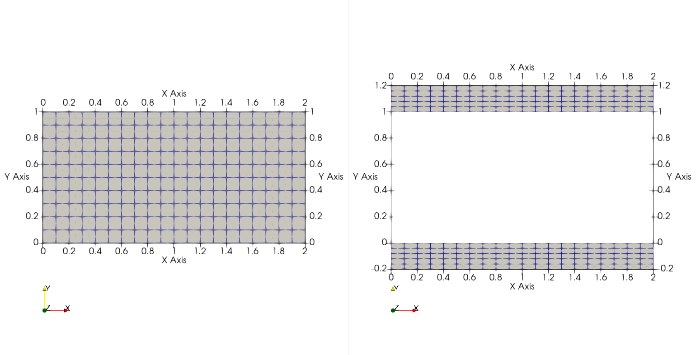
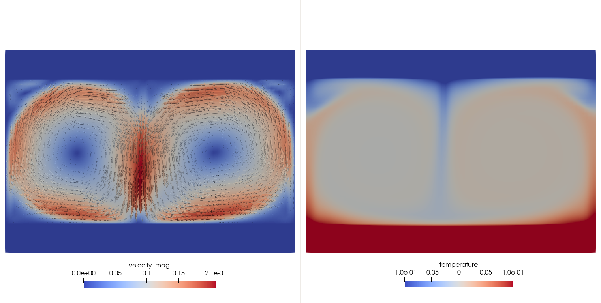

.. _conjugate_heat_transfer:

Conjugate Heat Transfer
=======================

In this tutorial, we simulate a simple quasi-2D Rayleigh-Benard convection (RBC) flow using *NekRS's* conjugate heat transfer capability.
The conjugate heat transfer capability solves the energy equation across both solid and liquid subdomains, while the incompressible Navier-Stokes equations are solved only in the liquid subdomain.
In the case of RBC, this provides a continuous temperature profile through horizontal walls of finite thickness.
The modeled case corresponds to a simplified version of simulations performed by Foroozani et al. [Foroozani2021]_.

If you are not familiar with *NekRS*, we strongly recommend that you begin with the :ref:`fdlf` tutorial first!
Get started with creating a directory, ``cht``, to run this case in your favorite ``scratch`` folder.

.. code-block:: bash

   cd $HOME/scratch
   mkdir cht
   cd cht

Governing Equations and Thermo-fluid Properties
________________________________________________

This tutorial employs the Boussinesq approximation in the fluid, wherein density variations are assumed small and retained only in the buoyancy term.
The resulting momentum and energy governing equations, written in non-dimensional form, for the fluid subdomain are:

.. _cht_eq:

.. math::

    \frac{\partial \mathbf{u^*}}{\partial t^*} + \mathbf{u^*} \cdot \nabla \mathbf{u^*}\ = -\nabla p^* + \frac{1}{Re}\Delta\mathbf u^* - \mathbf{\hat{g}} \Theta Ri.

    \frac{\partial \Theta}{\partial t^*} + \mathbf u^* \cdot \nabla \Theta = \frac{1}{Pe} \nabla^2 \Theta

where, :math:`Ri = \frac{g \beta_T \Delta T L}{U^2}` is the Richardson number, :math:`Re = \frac{\rho_0 U L}{\mu_0}` is the Reynolds number and :math:`Pe = Re Pr` is the Peclet number.
:math:`Pr = \frac{\mu_0}{\rho_0 \alpha_0}` is the Prandtl number of the fluid.
:math:`\beta_T` is the coefficient of thermal expansion, :math:`g` is the gravitational acceleration and :math:`\rho_0`, :math:`\mu_0` and :math:`\alpha_0` are the reference fluid density, dynamic viscosity and thermal diffusivity, respectively.
For natural convection simulations, the velocity scale is typically given by the buoyant velocity, i.e., :math:`U = \sqrt{g \beta_T L \Delta T}`. 
For the solid subdomain, the energy equation further simplifies since the convective term on the left hand side drops.
Using consistent characteristic velocity and length scales, the governing equation in solid subdomain is

.. math:: 

  \frac{\partial \Theta}{\partial t^*} = \frac{\alpha_r}{Pe} \nabla^2 \Theta

where, :math:`\alpha_r` is the ratio of solid to fluid thermal diffusivity.
The non-dimensional properties selected for this tutorial are summarized in the following table:

.. _cht_table:

.. csv-table:: Non-dimensional fluid and thermal properties
   :align: center
   :widths: 30,10,20
   :class: tall
   :header: Dimensionless number, Definition, Value

   "Rayleigh number, :math:`Ra`", ":math:`\frac{\rho_0 g \beta_T \Delta T L^3}{\mu_0 \alpha_0}`",":math:`10^7`"
   "Prandtl number (fluid), :math:`Pr`",":math:`\frac{\mu_0}{\rho_0 \alpha_0}`",":math:`0.7`"
   "Richardson number, :math:`Ri`",":math:`\frac{g \beta_T \Delta T L}{U^2}`",":math:`1`"
   "Reynolds number, :math:`Re`",":math:`\frac{\rho_0 U L}{\mu_0}`",":math:`\sqrt{\frac{Ra}{Pr Ri}} \approx 3780`"
   "Peclet number, :math:`Pe`",":math:`Re Pr`",":math:`\approx 2646`"
   "Thermal diffusivity ratio, :math:`\alpha_r`",":math:`\frac{\alpha_s}{\alpha_0}`",":math:`0.2`"

Geometry and Boundary Conditions
_________________________________

.. _fig:cht_mesh:

   Z-normal view of fluid (left) and solid (right) subdomains. Hexahedral elements from Gmsh are shown.

The fluid and solid subdomains for this example are as shown above.
The base hexahedral mesh, generated using Gmsh, is also highlighted in the figure (see next section).
Both fluid and solid domains are periodic in z-normal direction.
Note that an arbitrary thickness of 0.1 is specified in the z-direction with 3 elements.

.. note::

  *NekRS* mesh must have minimum of 3 elements across periodic boundaries.

All bounding surfaces of the fluid domain are wall boundaries (zero-slip), while the x-normal side walls are thermally insulated.
In the solid domain, the x-normal walls are also insulated, while Dirichlet thermal boundary conditions are assigned on the top and bottom surfaces. 

Mesh Generation
________________

This tutorial uses mesh generated using the `Gmsh tool <https://gmsh.info/doc/texinfo/gmsh.html>`_.
It is assumed that the user has successfully installed Gmsh on their system and has basic familiarity with generating meshes using this tool.
Gmsh generates script files with the extension ``.geo`` which has the geometry and boundary ID information for the mesh.
For the convenience of the user, the required ``.geo`` files for generating the meshes for this tutorial can be downloaded using the following links:

* :download:`fluid.geo <cht/mesh/fluid.geo>`
* :download:`solid.geo <cht/mesh/solid.geo>`

Download the above files and save them in the working case directory - ``cht``.
The user must use these files to generate corresponding mesh files with ``.msh`` extension.

.. tip::

   Typical steps to generate ``.msh`` file from ``.geo`` files are as follows:

   * Open ``.geo`` file in Gmsh GUI
   * Expand the ``Mesh`` tree in side navigation window in the GUI and generate mesh using the following steps:

     - Select ``1D``

     - Select ``2D``

     - Select ``3D``

     - Select ``Set Order 2``

   * Now save the mesh by selecting ``Export`` option from the ``File`` tab on top navigation bar. 

     - A window will open where the name and location of mesh file can be assigned. The user must also assign the file extension. For this example, assign the name ``fluid.msh`` or ``solid.msh`` for the corresponding ``fluid.geo`` or ``solid.geo`` file that is currently open.

     - Another window will open that will prompt the user for mesh options:

        + For the format select ``Version 2 Binary``

        + Ensure ``Save all elements`` is unchecked.

        + Ensure ``Save parameteric coordinates`` is unchecked

        + Select ``Ok``

Following the above steps for both ``fluid.geo`` and ``solid.geo`` files will generate the mesh files ``fluid.msh`` and ``solid.msh`` files in the selected directory.
The ``.msh`` files can also be directly downloaded using the following links:

* :download:`fluid.msh <cht/mesh/fluid.msh>`
* :download:`solid.msh <cht/mesh/solid.msh>`

``gmsh2nek`` is the tool to convert the Gmsh files into *NekRS* format. 
It is packaged and provided with *Nek5000*.
For details on how to procure and compile ``gmsh2nek`` see :ref:`nek5000_tools`.
Run the ``gmsh2nek`` tool from the directory containing both ``fluid.msh`` and ``solid.msh`` files and follow the prompts as follows:

.. code-block:: bash

  Enter mesh dimension: 3

.. code-block:: bash
  
  Input fluid .msh file name: fluid
  reading mesh file fluid.msh
  total node number is         6027
  total quad element number is          580
  total hex element number is          600
  total fluid hex number:          600

Entering the name of fluid mesh file, as shown above, prints information on number of elements and nodes in the mesh.
Continuing further, the next prompt is specific to generating meshes for :term:`CHT` cases.
Specify the solid mesh as shown:

.. code-block:: bash

   Do you have solid mesh ? (0 for no, 1 for yes) 1
   Input solid .msh file name: solid
   reading mesh file solid.msh
   total node number is         6314
   total quad element number is          700
   total hex element number is          600

Next, ``gmsh2nek`` will provide information on the boundary surfaces and their corresponding IDs in the fluid and solid mesh files.
There are declared in the ``.geo`` files and propogated by Gmsh in the ``.msh`` file. 
The boundary information in the ``fluid.msh`` and ``solid.msh`` as printed by ``gmsh2nek`` is as follows:

.. code-block:: bash

  total hex number:         1200
  reading mesh file fluid.msh
  ******************************************************
  Fluid mesh boundary info summary
  BoundaryName     BoundaryID
  p1           1
  p2           2
  sideWalls           3
  walls           4
  ******************************************************
  reading mesh file solid.msh
  ******************************************************
  Solid mesh boundary info summary
  BoundaryName     BoundaryID
  walls           4
  p1          11
  p2          12
  bottomWall          13
  topWall          14
  sideWalls          15
  ******************************************************
  performing non-right-hand check

.. note::

  Make a note of the ``BoundaryID`` in the mesh files. 
  These integer identifiers are required for setting up the *NekRS* case.

``walls`` are the y-normal common surfaces interfacing the fluid and solid meshes.

.. warning::

  Note that the common surfaces must be assigned identical ``BoundaryID`` in fluid and solid ``.geo`` files. 
  The user must ensure this while generating  geometry (``.geo`` file) in Gmsh for :term:`CHT` cases.
  Other surfaces can have arbitrary unique or identical ``BoundaryID`` depending on the intended boundary condition for the surfaces.

``sideWalls`` are the x-normal walls in fluid and solid meshes and the ``topWall`` and ``bottomWall`` are the y-normal top and bottom surfaces in the solid mesh.
``p1`` and ``p2`` in the fluid and solid meshes are z-normal surfaces.
In this example we will assign them periodic boundary condition, in order to setup a quasi-2D case with periodicity in z-direction.
Note that while other boundary conditions are assigned in *NekRS* case files, the periodic boundary conditions must be established in the *NekRS* mesh file.
``gmsh2nek`` will prompt the user for setting up boundary condition, as shown below:

.. code-block:: bash

  For Fluid domain
  Enter number of periodic boundary surface pairs:
  1
  input surface 1 and  surface 2  Boundary ID
  1 2

Enter, as shown above, the number of pairs of periodic boundaries in the mesh, 1 in this case.
Following that, enter the corresponding boundary IDs in the fluid mesh for ``p1`` and ``p2`` surfaces - 1 2.
``gmsh2nek`` will confirm that periodicity was successfully established with the following message:

.. code-block:: bash

 translation vector:    2.2204460492503131E-016     0.0000000000000000         0.10000000000000001
 offset and normalize periodic face coordinates
 bucket sorting to make index of each point
 doing periodic check for surface           1
 doing periodic check for surface           2
 ******************************************************
 Please set boundary conditions to all non-periodic boundaries
 in .usr file usrdat2() subroutine
 ******************************************************

Similary, establish periodicity for the z-surfaces in the solid domain:

.. code-block:: bash

  For Solid domain
  Enter number of periodic boundary surface pairs:
  1
  input surface 1 and  surface 2  Boundary ID
  11 12
  translation vector:   -2.2204460492503131E-016     0.0000000000000000        -0.10000000000000002
  offset and normalize periodic face coordinates
  bucket sorting to make index of each point
  doing periodic check for surface          11
  doing periodic check for surface          12
  ******************************************************
  Please set boundary conditions to all non-periodic boundaries
  in .usr file usrdat2() subroutine
  ******************************************************

Finally, ``gmsh2nek`` will ask the user the desired name of the *NekRS* mesh file. 
Specify ``cht`` as shown:

.. code-block:: bash

  please give re2 file name:
  cht

  writing cht.re2
  velocity boundary faces:          580
  thermal boundary faces:         1280

``gmsh2nek`` will now generate ``cht.re2`` in the working directory and also print information on the total number of element faces in the fluid and solid mesh.

Control Parameters (.par file)
_________________________________

In the ``cht`` working directory, open file ``cht.par`` with your favorite text editor and specify *NekRS* parameters as follows (see details on :ref:`par_file`):

.. literalinclude:: cht/cht.par
  :language: bash

In the ``[GENERAL]`` section specify the scalar identifier for temperature field using ``scalars = temperature`` key and value.
A conjugate heat transfer case has some important distinctions in the ``.par`` file as compared to a more typical case with fluid only mesh.
Particularly, the boundary surfaces of the :term:`CHT` mesh must be carefully assigned under the ``[MESH]`` section using the ``boundaryIDMapFluid`` key, in addition to the ``boundaryIDMap`` key.

.. note::

  For a non-CHT case the mesh surfaces are defined using the ``boundaryIDMap`` key.
  ``boundaryIDMapFluid`` is only required for a :term:`CHT` case to explicitly specify the fluid subdomain mesh IDs.

The sequence of comma-separated integer values assigned to the ``boundaryIDMap`` or ``boundaryIDMapFluid`` correspond to the mesh boundary IDs specified in the third-party mesher, Gmsh in this case.
The boundary IDs were detailed in the previous section and can be recorded from the ``gmsh2nek`` output.
The mesh boundary IDs may be specified to these keys in any arbitrary sequence, but the corresponding boundary conditions specified in specific field sections using ``boundaryTypeMap`` must be consistent with the sequence of mesh surface IDs.
As defined in previous section the fluid subdomain mesh has periodic z-surfaces ``1`` and ``2``, x-normal side walls with ID ``3`` and y-normal walls with ID ``4``.
The corresponding boundary condition in the ``[FLUID VELOCITY]`` section specified with ``boundaryTypeMap`` is ``zeroDirichlet`` for surface IDs ``3`` and ``4`` and ``none`` for periodic surfaces ``1`` and ``2``.

The user should take note that the ``boundaryTypeMap`` in ``[SCALAR TEMPERATURE]`` section specifies boundary conditions for all mesh surfaces, including fluid and solid subdomains.
The solid-fluid interface surface, which has the ID ``4`` as assigned in Gmsh (see previous section), has the value ``none``.
Similarly, the periodic mesh surfaces ``1,2`` and ``11,12`` also have the value ``none``.

.. note::

  Periodic or internal surface must be assigned the value ``none`` in ``boundaryTypeMap``.

The side walls in both fluid (``3``) and solid (``15``) subdomains are thermally insulated and assigned the ``zeroNeumann`` value, while the top and bottom surfaces of the solid domain have Dirichlet thermal boundary conditions, identified with ``udfDirichlet`` value.

Another important distinction between a :term:`CHT` case and fluid only mesh case is in the material property specification for the scalar field in ``.par`` file.
The properties for this case are listed in :ref:`this table <cht_table>`.
In ``[SCALAR TEMPERATURE]`` it is required to distinguish the mesh for the solution of the scalar field with ``mesh = fluid+solid`` key, which instructs the solver to solve the ``TEMPERATURE`` field in both fluid and solid subdomains.
The material properties in the fluid subdomain are specified with the usual keys, ``transportCoeff`` and ``diffusionCoeff`` for volumetric heat capacity :math:`(\rho c_p)` and thermal conductivity :math:`(\lambda)`, respectively.
Corresponding properties in the solid subdomain are assigned with the keys ``transportCoeffSolid`` and ``diffusionCoeffSolid``.

.. note::

  Since this simulation is setup in non-dimensional format:

  * ``transportCoeff = 1`` (:math:`\rho c_p` of fluid for dimensional case)
  * ``transportCoeffSolid = 1`` (:math:`\rho c_p` of solid for dimensional case)
  * ``diffusionCoeff = 1 / Pe`` (:math:`\lambda` of fluid for dimensional case)
  * ``diffusionCoeffSolid = \alpha_r / Pe`` (:math:`\lambda` of solid for dimensional case)

.. tip::

  The above method for property specification in ``.par`` file is valid if properties in the subdomains are spatially and temporally constant.
  In case the user wants varying properties, they must be specified in ``.udf`` file.
  See :ref:`properties_cht` for details.

This case also uses some user defined parameter, specified in ``userSections`` - ``[CASEDATA]`` which are used for setting up boundary and initial conditions in ``.udf`` file.

* ``Tboundary`` is used to specify Dirichlet boundary condition
* ``Richardson`` is used to specify Richardson number

Remaining entries in the ``.par`` file are similar to a typical fluid only case.
For more details see :ref:`par_file`.

User-Defined Host Functions File (.udf)
_______________________________________

Loading User Parameters
^^^^^^^^^^^^^^^^^^^^^^^^

Begin with opening ``cht.udf`` file in your favorite editor and declaring some global variables we will use in the ``.udf`` file:

.. literalinclude:: cht/cht.udf
  :language: cpp
  :lines: 1-4

In ``UDF_Setup0`` routine read the values from ``.par`` file into these global variables

.. literalinclude:: cht/cht.udf
  :language: cpp
  :lines: 49-55

As mentioned earlier, ``Tboundary`` is the absolute of Dirichlet temperature value we will define at top and bottom solid mesh surfaces and ``Richardson`` is the Richardson number used to scale the buoyancy force.
Their values from ``.par`` file are store in ``Tb`` and ``Ri`` global variables, as shown above.
``o_gvec`` is a global :term:`OCCA` array defined to store the unit gravitational force vector.
Since, we also intend to make ``Tb`` and ``Ri`` values available in :ref:`okl_block`, also load these into kernel macros ``p_Tb`` and ``p_Ri`` in ``UDF_LoadKernels`` function as shown:

.. literalinclude:: cht/cht.udf
  :language: cpp
  :lines: 55-61

Initializations
^^^^^^^^^^^^^^^^

Next, add ``UDF_Setup`` routine as follows:

.. literalinclude:: cht/cht.udf
   :language: cpp
   :lines: 61-99

The internal *NekRS* pointer, ``nrs->userSource``, is assigned to a user-defined routine in ``.udf`` - ``userSource``.
It is detailed in the next sub-section.
The gravitational vector is defined next and populated in the ``o_gvec`` :term:`OCCA` array.
``o_gvec`` is allocated using ``platform->device.malloc<dfloat>``.
Note that the force is acting in the negative y-direction.

The next task is to assign initial conditions, which is done in an if block which checks for the condition if the case is being restarted, as shown above.
It is important to note in the code above that the velocity components and temperature are initialized in separate blocks (enclosed with `{}`).
This is because the mesh objects for the fluid and solid subdomains are different.
When initializing the velocity components the ``fluid->mesh`` object is used, whereas for temperature initialization the ``scalar->mesh("temperature")`` object must be used.
Subsequently the mesh coordinates can be procured into host arrays using a convenient routine, ``mesh->xyzhost()``.
Loop over ``mesh->Nlocal`` can then be used to fill out initial condition for velocity or temperature into temporary host container arrays ``U`` and ``T``.
As shown above, assign zero temperature value to the fluid subdomain, ``Tb`` to the bottom part of solid subdomain and ``-Tb`` to the top part.
Finally, copy the initial values from host container arrays, ``U`` and ``T``, to field :term:`OCCA` arrays, ``fluid->o_U`` and ``scalar->o_solution("temperature")``, using ``copyFrom`` routine. 

Custom Buoyancy Source
^^^^^^^^^^^^^^^^^^^^^^

The ``userSource`` routine is as follows and it is used to assign the buoyancy force term to the momentum equation for this case.

.. literalinclude:: cht/cht.udf
   :language: cpp
   :lines: 33-49

``buoForce`` is a custom kernel function, detailed in next section, which takes fluid density (``o_rho``), gravity vector (``o_gvec``) and temperature (``o_temp``) to construct the buoyancy force populated in ``fluid->o_EXT``, which is the explicit forcing array for the momentum equation.

Boundary Conditions and Buoyancy Force (okl block)
^^^^^^^^^^^^^^^^^^^^^^^^^^^^^^^^^^^^^^^^^^^^^^^^^^^

Dirichlet boundary conditions for temperature are assigned within the ``udfDirichlet`` kernel function as shown below.
It is important to note that the sequence of mesh IDs specified in ``.par`` file using the ``boundaryIDMap`` or ``boundaryIDMapFluid`` key are mapped internally in ascending integer sequence starting from 1.
Thus, the bottom surface with mesh ID ``13`` is mapped to ``bc->id = 5``, while the top surface with mesh ID ``14`` is mapped to ``bc->id = 6``.
These can be used to identify the boundary surface in ``udfDirichlet``.
As shown, the bottom surface is assigned the temperature value of ``p_Tb``, while the top surface ``-p_Tb``.

.. literalinclude:: cht/cht.udf
   :language: cpp
   :lines: 4-33

The ``buoForce`` is a custom kernel included in the OKL block to fill buoyancy force in the explicit forcing array for momentum equation, i.e., ``nrs->o_fluid->o_EXT``.
The magnitude of forcing term, as in :ref:`momentum equation <cht_eq>`, is :math:`Ri \Theta`.

.. note::

  Note, density array ``RHO`` has unit values for the non-dimensional case.
  It not necessarily needed for current setup.
  The array is passed to ``buoForce`` kernel in the above setup for generality.
  It will be needed for dimensional case.

UDF_ExecuteStep
^^^^^^^^^^^^^^^

No operations are performed in the ``UDF_ExecuteStep`` for this tutorial.
However, it is a necessary routine.
Thus, include it as shown.

.. literalinclude:: cht/cht.udf
   :language: cpp
   :lines: 99-102

Compilation and Running
_________________________

All required case files for RANS wall-resolved channel simulation can be downloaded using the links below:

 * :download:`cht.re2 <cht/cht.re2>`
 * :download:`cht.par <cht/cht.par>`
 * :download:`cht.udf <cht/cht.udf>`

If for some reason you encountered an insurmountable error and were unable to generate any of the required files, you may use the provided links to download them.
Now you can run the case.

.. code-block:: console

   $ nrsbmpi cht 4

The above command will launch an MPI jobs on your local machine using 4 ranks.
The output will be redirected to ``logfile``.

Results
________

Once execution is completed your directory should now contain multiple checkpoint files that look like this:

.. code-block:: bash

  cht0.f00000
  cht0.f00001
  ...
  
The preferred mode for data visualization with *NekRS* is to use Visit or Paraview. 
This requires generating a metadata file with ``nrsvis``.
It can be run with

.. code-block:: console

  $ nrsvis cht

to obtain a file named ``cht.nek5000``.
This file can be opened with either Visit or Paraview.
In the viewing window, the velocity magnitude and temperature fields can be visualized.
The image below shows the contour profiles at steady state. 

.. _fig:cht:

   Steady-state velocity magnitude (left) and temperature (right) contours.
