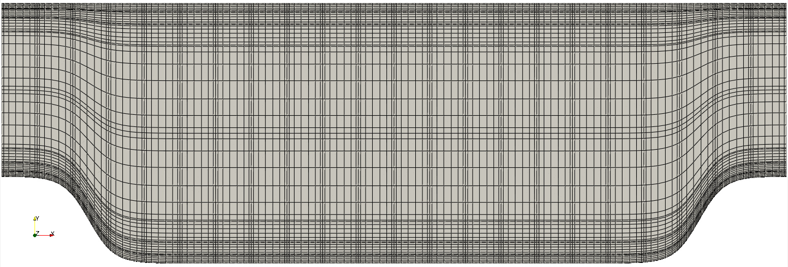

.. _periodic_hill:

Periodic Hill
=============

This tutorial will describe how to run a case from scratch, the procedure is illustrated throuugh a relatively simple example involving incompressible laminar flow in a two-dimensional periodic hill domain. 
The implementation is loosely based on the case presented by Mellen et al. [Mellen2000]_. 
A thorough review for this case can be found in the `ERCOFTAC <http://qnet-ercoftac.cfms.org.uk/w/index.php/Abstr:2D_Periodic_Hill_Flow>`_ knowledge base wiki.

Before You Begin
................

This tutorial assumes that you have installed *NekRS* in your home directory and 
have setup your :ref:`PATH <nekrs_home>`. You can either follow the example 
with the files in the fdlf directory within examples directory of nekRS, or create 
it within a directory of your choice.

If you have chosen to create the example as following along, you will need to 
compile the *Nek5000* tool ``genbox`` for the initial mesh generation. Please follow
the instructions in the :ref:`Building the Nek5000 Tool Scripts <scripts>` section.

Mesh generation
...............

This tutorial will use a simple box mesh generated by
``genbox``, save the following to a new file ``hillp.box``:

.. literalinclude:: ./periodic_hill/hillp.box

For this mesh 22 uniform elements are specified in the stream-wise (x) direction. 
8 non-uniform elements are specified in the span-wise (y) direction in order to resolve the boundary layers, and a single element in the z-direction. 
The boundary conditions are periodic in the x-direction and no-slip in the y. 
Additional details on generating meshes using ``genbox`` can be found :ref:`here <tools_genbox>`.

Now we create the mesh by running:

.. code-block:: console

   $ genbox

On input provide the input file name (e.g. ``hillp.box``).
The tool will produce a binary mesh and boundary data file ``box.re2`` which should be renamed to ``hillp.re2``.

User Defined Functions file (.udf)
..................................

The UDF file allows the user to interact with the solver, to get started create a file ``hillp.udf`` in the current directory.

Modify mesh
-----------

For a periodic hill, we will need to modify the geometry.  Let :math:`{\bf x} := (x,y)` denote the old geometry, and :math:`{\bf x}' := (x',y')` denote the new geometry.  For a domain
with :math:`y\in [0,3]` and :math:`x\in [0,9]` the following function will map the straight pipe geometry to a periodic hill:

.. math::

    y'(x,y) = y + C(3-y)\Big\{1+\tanh\big[B(|x-A|-B)\big]\Big\} .

where :math:`A=4.5, B=3.5, C=1/6`.
We have chosen these constants so that the height of the hill (our reference length), :math:`h=1`. 
Note that, as :math:`y \longrightarrow 3`, the perturbation, goes to zero.
So that near :math:`y = 3`, the mesh recovers its original form.

In NekRS we can specify this through ``UDF_Setup`` in the ``.udf`` file:

.. literalinclude:: ./periodic_hill/hillp.udf
   :language: c++
   :lines: 12-16
   :emphasize-lines: 4

By modifying the mesh in ``UDF_Setup``, the modification is applied to the GLL points directly. 
This allows the mesh to conform to the specified profile to :math:`N^{th}`-order accuracy.
The deformed mesh with the GLL points is shown in :numref:`fig:hill_mesh` below.

.. _fig:hill_mesh:

    Modified box mesh graded

Initial & boundary conditions
-----------------------------

The next step is to specify the initial conditions.
This can be done by adding the following to ``UDF_Setup``:

.. literalinclude:: ./periodic_hill/hillp.udf
   :language: c++
   :lines: 19-23

For walls and periodic boundaries, nothing needs to be specified in the user file, so ``scalarDirichletConditions``
and ``scalarNeumannConditions`` do not need to be defined.

Control parameters
..................

The control parameters for any case are given in the ``.par`` file. For this case, using any text editor, create a new file called ``hillp.par`` and type in the following:

.. literalinclude:: ./periodic_hill/hillp.par
   :language: ini
   :emphasize-lines: 9

We have set the calculation to stop at the physical time of :math:`T=200` (``endTime=200``) which is roughly 22 flow-thru time units (based on the bulk velocity :math:`u_b` and length of periodic pitch, :math:`L=9`).
The step size is allowed to adjust to match the target CFL, with an initial size of `1e-1`.

To drive the flow, a forced flow rate in the x-direction is applied such that bulk velocity :math:`u_b=1`.
This is accomplished with the highlighted line.

.. Warning::

   The forced flow rate options are only intended for use with periodic boundaries!

In choosing ``viscosity = -100`` we are actually setting the Reynolds number. This assumes that
:math:`\rho \times u_b \times h = 1` where :math:`u_b` denotes the bulk velocity and :math:`h` the hill height.  

Additional details on the names of keys in the ``.par`` file can be found :ref:`here <case_files_par>`.

Compilation and running
.......................

With the ``hillp.udf`` file created, you should now be all set to compile and run your case!
As a final check, you should have the following files:

 * :download:`hillp.par <periodic_hill/hillp.par>`
 * :download:`hillp.re2 <periodic_hill/hillp.re2>`
 * :download:`hillp.udf <periodic_hill/hillp.udf>`

If for some reason you encountered an insurmountable error and were unable to generate any of the required files, you may use the provided links to download them.
After confirming that you have all three, you are now ready to run:

.. code-block:: console

   $ nrsbmpi hillp 4

This will run the Just-in-Time (JIT) compiler and then launch an MPI job using 4 ranks. The output will be redirected to ``logfile``.

Post-processing the results
...........................

Once execution is completed your directory should now contain multiple checkpoint files that look like this::

  hillp.f00001
  hillp.f00002
  ...

The preferred mode for data visualization and analysis with Nek5000 is
to use Visit/Paraview. If Paraview is in your ``PATH`` you can run:

.. code-block:: console

   $ paraview hillp.nek5000

n the viewing window one can visualize the flow-field as depicted in
:numref:`fig:hill_flow`.

.. _fig:hill_flow:

.. figure:: periodic_hill/hill_flow_v3.png
    :align: center
    :figclass: align-center
    :alt: per_flow

    Visualization of the steady-state flow field. Vectors represent velocity. Colors represent velocity magnitude. Note, velocity vectors are equal size and not scaled by magnitude.

