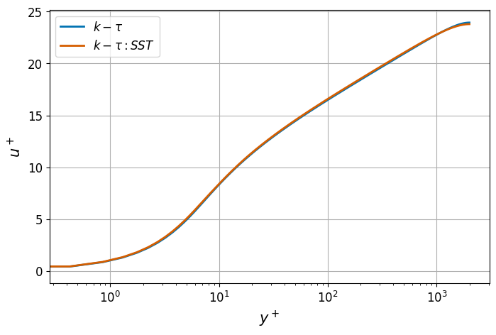
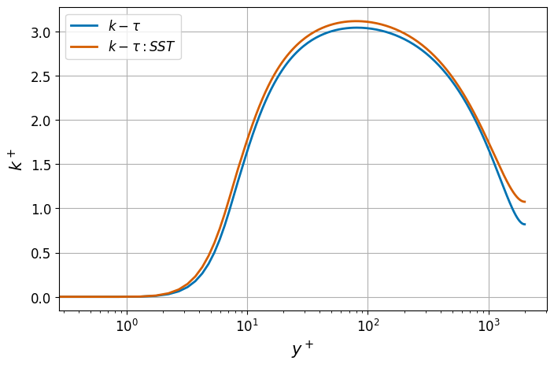

.. _tutorial_rans:

------------
RANS Channel
------------

This tutorial describes the essential setup details for a wall-resolved RANS simulation, illustrated through a turbulent channel flow case. 
The :math:`k-\tau` and :math:`k-\tau SST` RANS models are employed for this tutorial.
More information on the :math:`k-\tau` model can be found :ref:`here <rans_models>`. 

..........................
Before You Begin
..........................

It is highly recommended that new users familiarize themselves with the basic *NekRS* simulation :ref:`setup files <case>` and procedures outlined in the :ref:`fdlf` tutorial.

..............................
Mesh and Boundary Conditions
..............................
 
The mesh is generated with ``genbox`` utility using the following input file

.. literalinclude:: ktauTutorial/channel.box
   :language: none 
   
It creates an infinite 3D half-channel of non-dimensional width :math:`1`. 
The streamwise (:math:`x`) direction has 5 elements with periodic (``P``) boundary conditions.
The wall-normal (:math:`y`) direction has 12 elements with a symmetry (``SYM``) boundary condition specified at the top face and a wall (``W``) boundary on the bottom face. 
Corresponding boundary conditions for the :math:`k` and :math:`\tau` transport equations are insulated (``I``) at the symmetry boundary and Dirichlet (``t``) type (equal to zero) at the wall.
The spanwise (:math:`z`) direction has 3 elements with periodic (``P``) boundary conditions.
The mesh is further modified in the ``.udf`` file to refine it near the wall to resolve boundary layers, as explained in following sections. 

..............................
Control Parameters (.par file)
..............................

Details of the structure of the parameter file can be found :ref:`here <parameter_file>`. 
The parameter file for this case is as follows,

.. literalinclude:: ktauTutorial/channel.par
   :language: ini 

For RANS simulations it is critical to include two additional scalars which correspond to the :math:`k` and :math:`\tau` fields respectively. 
This is done using the ``scalars`` key in ``[GENERAL]`` section by the string identifiers ``"k"`` and ``"tau"`` as shown above.
In addition, it is essential to also include the ``[PROBLEMTYPE]`` card and specify the ``equation`` key as ``navierStokes+variableViscosity``.
This ensures that a spatially varying diffusion field can be used to include eddy viscosity in the RANS momentum equation, as discussed :ref:`here <rans_models>`.

For this particular tutorial, the simulation is :ref:`non-dimensionalized <nondimensional_eqs>` and flow properties are ``rho=1.0`` and ``viscosity=1/43500``. 
The properties are assigned in ``.par`` file under the ``[FLUID VELOCITY]`` section as shown above.
``[SCALAR K]`` and ``[SCALAR TAU]`` sections must also be included in the ``.par`` file.

.. warning::

   For RANS cases, no transport properties must be assigned under the ``[SCALAR K]`` and ``[SCALAR TAU]`` sections.
   These are assigned internally by *NekRS*. 
   If any properties are assigned under these sections, the solver with throw an informative error and exit.

It is strongly recommended to run RANS simulations in non-dimensional form. 
This setup corresponds to :math:`Re = 43,500`, which is well above the critical Reynolds number for a channel. 
The specified non-dimensional bulk velocity for the case is :math:`U_b=1`.
*NekRS* offers an inbuilt mechanism to maintain and control a specified control rate in periodic domains.
This is assigned through the ``constFlowRate`` key in ``[GENERAL]`` section, as shown above.
The key takes two parameters, viz., ``meanVelocity`` which is assigned the value of bulk velocity and ``direction`` takes the direction of streamwise velocity component.
The case corresponds to one of the DNS simulation performed by Lee and Moser [Lee2015]_ for turbulent channel flow.

Further, in this example a user section is included to specify the RANS model through the ``.par`` file in ``CASEDATA``.
Note that two models are included in the example, ``KTAU`` and ``KTAUSST``. 
The user can conveniently choose either model by assigning the value to ``MODEL`` key, as shown above.
This is parsed in the ``.udf`` as explained in following section.

............................................
User-defined Host Functions File (.udf file)
............................................

All RANS models in *NekRS* are available as plugins. 
Generic details on RANS setup can be found in the :ref:`setup guide here <ktau_model>`.

To get started, include the RANS header at the top of the ``.udf`` file,

.. literalinclude:: ktauTutorial/channel.udf
   :language: c++
   :lines: 1

The required internal arrays and data structures for RANS models are initialized in the ``UDF_Setup`` routine.
For this case the ``UDF_Setup`` setup is as follows,

.. literalinclude:: ktauTutorial/channel.udf
   :language: c++
   :lines: 93-132
	
Several operations are performed in the code snippet above.

Diffusion and Source terms
^^^^^^^^^^^^^^^^^^^^^^^^^^

``nrs->userProperties`` and ``nrs->userSource`` are internal pointer variables which must be assigned user defined routines for specifying spatially varying transport properties and source terms, respectively.
``uservp`` and ``userq`` are the corresponding routines which must be specified in ``.udf`` file, as shown below,

.. literalinclude:: ktauTutorial/channel.udf
   :language: c++
   :lines: 72-80

*NekRS* provides convenient routines, available in the namespace ``RANSktau``, for spatially varying diffusion and source terms, as shown above.
Details on the diffusion and source terms can be found in :ref:`RANS theory <rans_models>`.

Mesh Modification
^^^^^^^^^^^^^^^^^

Further, the ``UDF_Setup`` routine contains code to modify mesh y-coordinates for this case, in order to have fine boundary layers near the wall.
``mesh->xyzHost()`` call is used to fetch the pointers to the existing x, y and z coordinate arrays on the host.
Note that these variables are `std::vector``, dynamic container arrays.
Subsequently, the for loop goes through all :term:`GLL` points in the mesh and modifies the y-coordinate, based on a hyperbolic tangent profile.
After modifying the coordinates on the host, the arrays must also be copied to the device arrays, ``mesh->o_y``, using the ``copyFrom`` call.

Initial Conditions
^^^^^^^^^^^^^^^^^^

Next essential operation that must be included in ``.udf`` file is initialization of velocity, :math:`k` and :math:`\tau` fields.
In this example, the x-component of velocity is initialized to a uniform value of 1, :math:`k` to 0.01 and :math:`\tau` to 0.1.

.. note::

  The :math:`k` and :math:`\tau` fields can be initialized to any reasonable positive value. 
  For non-dimensional runs, 0.01 and 0.1 can be used as initial values. 
  It is not recommended to initial these fields to zero, to avoid division by zero of some source terms.

RANS Setup
^^^^^^^^^^

The final essential operation that must be included in ``UDF_Setup`` is the call to ``RANSktau::setup`` routine.
This function requires one essential parameter, which is the index of the :math:`k` scalar field, ``nrs->scalar->nameToIndex.find("k")->second``.
The second parameter is optional and specifies the RANS model name.
If a second parameter is not passed, *NekRS* defaults to the standard :math:`k-\tau` RANS model.
Note that for this case the model type is specified in ``.par`` file in ``[CASEDATA]`` section and read in ``UDF_Setup`` by extracting using the ``platform->par->extract`` function, as shown.

See the :ref:`RANS guide <ktau_model>` for all RANS models available in *NekRS* and how to specify them.

Boundary Conditions
^^^^^^^^^^^^^^^^^^^

The boundary conditions for :math:`k` and :math:`\tau` scalar fields on the channel wall are specified in the :ref:`OKL block <okl_block>` in the ``udfDirichlet`` device function as follows,

.. literalinclude:: ktauTutorial/channel.udf
   :language: c++
   :lines: 3-11

``isField()`` function helps identify the scalar field using the string identifier specified in ``.par`` file.
Note that the boundary condition on the wall for both :math:`k` and :math:`\tau` transport equations are zero.

Execute Step Routine
^^^^^^^^^^^^^^^^^^^^

The final essential routine in ``.udf`` is the ``UDF_ExecuteStep`` routine:

.. literalinclude:: ktauTutorial/channel.udf
   :language: c++
   :lines: 168-174

Any case specific post-processing can be performed in this routine. 
``nrs->lastStep`` identifies the last step in the simulation and it can be used to perform any post-processing operations before the simulation terminates.
For this case, two optional post-processing routines are provided, explained in the following sections.

..............................
Compilation and Running
..............................

All required case files for RANS wall-resolved channel simulation can be downloaded using the links below:

 * :download:`channel.re2 <ktauTutorial/channel.re2>`
 * :download:`channel.par <ktauTutorial/channel.par>`
 * :download:`channel.udf <ktauTutorial/channel.udf>`

If for some reason you encountered an insurmountable error and were unable to generate any of the required files, you may use the provided links to download them.
Now you can run the case.

.. code-block:: console

   $ nrsbmpi channel 4

The above command will launch an MPI jobs on your local machine using 4 ranks.
The output will be redirected to ``logfile``.
 
..............................
Results
..............................

For reference, the results obtained from the :math:`k-\tau` and :math:`k-\tau SST` RANS wall-resolved models are shown below:

.. _fig:streamwise_vel:

   Normalized stream-wise velocity from different RANS models.
   
.. _fig:chan_tke:

   Normalized TKE from different RANS models.

...................................
Optional: Post-processing Routines
...................................

For the convenience of the user, post-processing routines are provided in the above downloadable ``.udf`` file.
The routines are specific to this case, but may be adopted for other cases with suitable modifications.

.. _extract_line:

Data Extraction Along a Line
^^^^^^^^^^^^^^^^^^^^^^^^^^^^

The routine shown below extracts x-component of velocity and :math:`k` profile along 200 data points distributed along a vertical line from :math:`(7,-1,0.5)` to :math:`(7,0,0.5)`.
*NekRS* offers inbuilt interpolation routines to find the value of any field at a specified point in the domain.
``interpolator->eval`` call evaluates the value of velocity and :math:`k` at the points stored in arrays ``xp, yp, zp``.
The extracted data is written into a file named ``profile.dat``.

More details on the usage of interpolation routines can be found :ref:`here <postprocessing>`.

.. literalinclude:: ktauTutorial/channel.udf
   :language: c++
   :lines: 14-72

Compute Friction Velocity
^^^^^^^^^^^^^^^^^^^^^^^^^

The following routine computes the surface averaged friction velocity evaluated at all walls in the domain.
The local friction velocity at any boundary :term:`GLL` point is defined as,

.. math::

   u_{\tau} = \sqrt{\frac{\| \vec{\tau_w} - \left(\vec{\tau_w} \cdot {\vec{n}} \right) {\vec{n}} \|}{\rho}} \\
   \vec{\tau_w} = \left. \mu [\nabla \vec{v} + \nabla \vec{v}^T] \cdot {\vec{n}} \right|_w

where :math:`\vec{n}` is the local normal vector at the boundary.
The average friction velocity is computed as,

.. math::

  \overline{u_\tau} = \frac{\int_{\Gamma} u_\tau d \Gamma}{\int_\Gamma d_\Gamma} 

where :math:`\Gamma` represents all wall boundaries.
The routine is as follows.
It also computes the relative error in computed mean friction velocity compared to the DNS value reported by [Lee2015]_.
For further details on the *NekRS* routine used below, see :ref:`Postprocessing <postprocessing>`.

.. literalinclude:: ktauTutorial/channel.udf
   :language: c++
   :lines: 136-166
