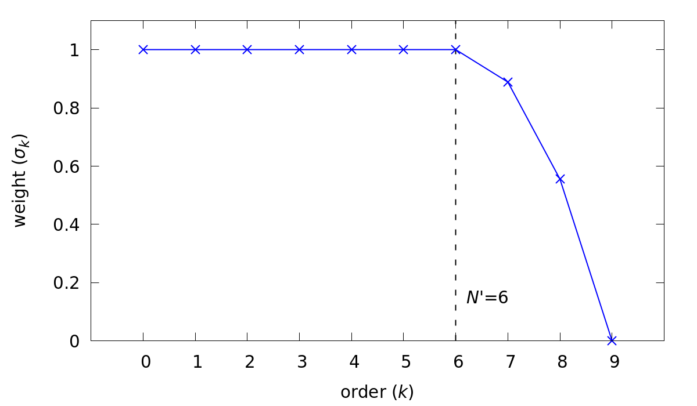

.. _models_properties:

Models and Source Terms
=======================

With the exception of :term:`LES` modelling, the :ref:`User-Defined Host Functions (.udf) <udf_functions>` file in NekRS provides the necessary and sufficient interface to load most of the physics models (and postprocessing capabilities).
For instance, the :ref:`RANS <rans_models>` and :ref:`lowMach compressible <low_mach>` models available in nekRS are loaded by including corresponding header files in ``.udf`` and by calling the appropriate functions from the standard functions in ``.udf``.
Appropriate boundary conditions for the momentum and scalar transport equations are specified in the :ref:`okl block <okl_block>` (or  in the included ``.oudf`` file).
Further, any custom source terms that may need to be added to the momentum or scalar equations are also interfaced through the ``.udf`` file.
Before proceeding it is, therefore, highly recommended that users familiarize themselves with all components of :ref:`.udf file <udf_functions>`. 

Turbulence models
-----------------

Large Eddy Simulation (LES)
"""""""""""""""""""""""""""

.. note::

  Pertinent example cases: `Tubulent pipe flow <https://github.com/Nek5000/nekRS/tree/next/examples/turbPipe>`_; `Turbulent channel flow <https://github.com/Nek5000/nekRS/tree/next/examples/turbChannel>`_

In NekRS, the sub-grid scale dissipation for :term:`LES` simulations is applied by means of a stabilizing filter, which
drains energy from the solution at the lowest resolved wavelengths, effectively acting as a sub-grid scale model. A
filter is necessary to run an LES turbulence model in NekRS and spectral methods in general, as they lack the numerical
dissipation necessary to stabilize a so-called "implicit LES" method, which relies on a lack of resolution to provide
dissipation.

The filter is constructed by means of a convolution operator applied on an element-by-element basis. Functions in the
SEM are locally represented on each element as :math:`N^{th}`-order tensor-product Lagrange polynomials in the reference
element, :math:`\hat\Omega\equiv[-1,1]^3`. This representation can readily be expressed as a tensor-product of Legendre
polynomials, :math:`P_k`. For example, consider

.. math::

  u(x)=\sum^N_{k=0}\hat u_k P_k(x)

:Reminder:
  :math:`N` is the polynomial order, :math:`N=` ``lx1`` :math:`-1`.

where :math:`u(x)` is any polynomial of degree :math:`N` on :math:`[-1,1]`.
As each Legendre polynomial corresponds to a wavelength on :math:`[-1,1]`, a filtered variant of :math:`u(x)` can be
constructed from

.. math::

  \tilde u(x)=\sum^N_{k=0}\sigma_k\hat u_k P_k(x).

By choosing appropriate values for the weighting factors, :math:`\sigma_k`, we can control the characteristics of the
filter. In *NekRS* we select a filter cutoff ratio, :math:`(N'+1)/(N+1)`, which can also be equivalently expressed as a
number of filtered modes, :math:`N_{modes}=N-N'`. Weights are chosen as

.. math::

  \sigma_k = 1\qquad\text{for}\qquad k\le N'\\
  \sigma_k < 1\qquad\text{for}\qquad k> N'

to construct a low-pass filter. 
An example is shown below in :numref:`fig:filter`.
The signal produced by this filter would have the highest Legendre mode (shortest wavelength) completely removed with
the next two highest modes significantly diminished. However, if the energy of the input signal is fully resolved on the
first six modes, the filter would not affect the signal at all.

.. _fig:filter:

   Example of a strong low-pass filter.

To construct the filter on a three-dimensional element, we define :math:`F` as the matrix operation that applies for
this one-dimensional low-pass filter. From there, the convolution operator representing the three-dimensional low-pass
filter, :math:`(G*)`, on the reference element, :math:`\hat\Omega`, is given by the Kronecker product
:math:`F \otimes F \otimes F`

.. math::

  {\bf \tilde u} = G * {\bf u} = (F \otimes F \otimes F) {\bf u}.

.. Warning::

  The filtered wavelengths depend on the local element size, so the filtering operation is **NOT** necessarily uniform
  across the domain.

High pass filter relaxation
^^^^^^^^^^^^^^^^^^^^^^^^^^^

The high-pass filter in *NekRS* is based on a method described by Stolz, Schlatter, and Kleiser [Stolz2005]_.
In the high-pass filter method, the convolution operator described above is used to obtain a low-pass filtered signal.
The high-pass filter term is then constructed from the difference between the original signal and the low-pass filtered
signal. For any scalar, this term has the form

.. math::

  \chi\left(u-\tilde u\right)

where :math:`u` is the original signal, :math:`\tilde u = G*u` is the low-pass filtered signal, and :math:`\chi` is a
proportionality constant. In polynomial space, this term is only non-zero for the last few Legendre modes, :math:`k>N'`.
It is subtracted from the RHS of the momentum, energy, and scalar transport equations, respectively

.. math::
  \frac{\partial \vec{u}}{\partial t}+{\vec{u}}\cdot\nabla{\vec{u}} &=-\nabla p+\frac{1}{Re}\nabla^2{\vec{u}}-\chi\left({\vec{u}}-G*{\vec{u}}\right)\\
  \frac{\partial T}{\partial t}+{\vec{u}}\cdot\nabla T &= \frac{1}{Pe}\nabla^2 T - \chi\left(T-G*T\right)\\
  \frac{\partial\phi_i}{\partial t} +{\vec{u}}\cdot\nabla\phi_i &= \frac{1}{ReSc} \nabla^2\phi_i -\chi\left(\phi_i-G*\phi_i\right)

and acts to provide the necessary drain of energy out of the discretized system.

The high-pass filter can be invoked by setting the ``regularization=hpfrt`` key in the ``[GENERAL]`` section of the
``.par`` file. The cutoff ratio used in the convolution operator, :math:`(G*)`, is controlled by adding the ``nModes``
option to the ``regularization`` key.

The convolution operation used to construct the filtered signal, :math:`\tilde u`, completely removes the highest
Legendre mode :math:`\sigma_N = 0`. The coefficients for the subsequent lower modes decrease parabolically until
:math:`\sigma_{N'}=1`. This corresponds to a strong low-pass filtering operation, similar to the one shown in
:numref:`fig:filter`.

The overall strength of the high-pass filter is controlled by the proportionality coefficient, :math:`\chi`, which is
set by adding the ``scalingCoeff`` option to the ``regularization`` key.

.. math::

  \chi = {\tt filterWeight}

Typical values for this are :math:`5\le\chi\le10`, which drains adequate energy to stabilize the simulations.

The high-wavenumber relaxation of the high-pass filter model is similar to the approximate deconvolution approach
[Stolz2001]_. It is attractive in that it can be tailored to directly act on marginally resolved modes at the grid
scale. The approach allows good prediction of transitional and turbulent flows with minimal sensitivity for model
coefficients [Schlatter2006]_. Furthermore, the high-pass filters enable the computation of the structure function in
the filtered or HPF structure-function model in all spatial directions even for inhomogeneous flows, removing the
arbitrariness of special treatment of selected (e.g. wall-normal) directions.

Generally recommended settings, specified in ``.par`` file, are as follows

.. code-block:: ini

   [GENERAL]
   regularization = hpfrt + nModes=1 + scalingCoeff=10

RANS models
"""""""""""

.. _ktau_model:

.. note::
  Pertinent example case: `Turbulent RANS Channel <https://github.com/Nek5000/nekRS/tree/next/examples/ktauChannel>`_

.. Note::
  RANS model requires two passive scalar fields which must be specified in control parameters ``(.par)`` file.
  For details on how to setup the ``.par`` file, refer to the section on :ref:`.par file <parameter_file>` and also
  refer :ref:`RANS Channel tutorial <tutorial_rans>` for specific example of ``.par`` file setup for :term:`RANS`
  simulation

The essential routines for the :term:`RANS` models in NekRS are available in the namespace in ``src/nrs/plugins/RANSktau.hpp``.
The default RANS model in nekRS is the :math:`k`-:math:`\tau` model [Tombo2024]_.
Details on the formulation of the :math:`k`-:math:`\tau` can be found :ref:`here <rans_models>`.

To use the :term:`RANS` model in nekRS, first add the necessary include file at the top of your ``.udf`` file:

.. code-block:: cpp

  #include "RANSktau.hpp"

The header file will make the required :term:`RANS` subroutines accessible in the ``.udf`` file which add the necessary source terms for the :math:`k` and :math:`\tau` transport equations and modify the diffusion operator in the momentum equation.

Further, in the ``UDF_Setup()`` subroutine, add the following code snippet to initialize the :term:`RANS` model,

.. code-block:: cpp
  
  void UDF_Setup()
  {
    nrs->userProperties = &uservp;
    nrs->userScalarSource = &userq;

    const auto ktauFieldStart = 1;

    RANSktau::setup(ktauFieldStart);
  }

``RANSktau::`` is the namespace declared in the header file ``RANSktau.hpp`` which contains all required :term:`RANS` subroutine call definitions.

``ktauFieldStart`` is the index of the scalar field where the turbulent kinetic energy, ``k``, is stored. 
In the above example, the :term:`TKE` field corresponds to ``SCALAR01`` as specified in ``.par`` file (see :ref:`tutorial <tutorial_rans>` for details).

.. warning::
  The ``ktauFieldStart`` index must be consistent with the chosen scalar index specified by user in ``.par`` file for :term:`TKE`.

.. note::
  nekRS assumes that the :math:`\tau` field array always follows the TKE scalar field. Thus, in the above example nekRS assumes :math:`\tau` field index is 2 (i.e., ``SCALAR02``).

``nrs->userProperties`` and ``nrs->userScalarSource`` are the pointer variables to internal subroutines in nekRS which are used to define the user specified transport properties and source terms for the passive scalar equations, respectively.
As in the above code, these are assigned the pointers to ``uservp`` and ``userq`` routines which must be defined in the ``.udf`` file as follows,

.. code-block:: cpp

  void uservp(double time)
  {
    RANSktau::updateProperties();
  }

  void userq(double time)
  {
    RANSktau::updateSourceTerms();
  }

The ``updateProperties()`` call computes the diffusion coefficients for the momentum and :math:`k`-:math:`\tau` equations (see :ref:`RANS theory <rans_models>` for details on RANS model equations), which are,

.. math::
  \text{momentum-equation} &\rightarrow \mu + \mu_t \\
  \text{k-equation} &\rightarrow \Gamma_k = \mu + \frac{\mu_t}{\sigma_k} \\ 
  \tau\text{-equation} &\rightarrow \Gamma_\tau = \mu + \frac{\mu_t}{\sigma_\tau}

.. note::
  ``updateProperties()`` also computes the eddy viscosity, :math:`\mu_t`, required in the above diffusion coefficients.
  If the user desires to extract :math:`\mu_t` array, say for post-processing purpose, it can be accessed as follows in the ``.udf`` file:
 ``auto o_mue_t = RANSktau::o_mue_t();``

while the ``updateSourceTerms()`` call computes all source terms on the right hand side of the :math:`k` and :math:`\tau` transport equations, which are, 

.. math::
  k\text{-equation} &\rightarrow P - \rho \beta^* \frac{k}{\tau} \\
  \tau\text{-equation} &\rightarrow -\alpha \rho \tau^2 S^2 + \rho \beta - 8 \Gamma_\tau \left( \nabla \tau^{1/2} \cdot \nabla \tau^{1/2} \right) + C_{D_\tau}

Note that the ``uservp`` and ``userq`` routines are called at each time step by the solver. 
The above calls will, therefore, update the diffusion properties and source terms at each time step for all GLL points.

The final necessary step in the model setup for the :math:`k`-:math:`\tau` :term:`RANS` model is the specification of the boundary conditions for the :math:`k` and :math:`\tau` transport equations. 
As explained in the :ref:`RANS theory <rans_models>` section, the wall boundary condition for both :math:`k` and :math:`\tau` equations are zero.
These must be explicitly assigned in the :ref:`okl block <okl_block>` section of ``.udf`` file,  

.. code-block:: cpp

  #ifdef __okl__

  void codedFixedValueScalar(bcData *bc)
  {
    if(bc->scalarId == 1 || bc->scalarId == 2) bc->s = 0;
  }

``bc->scalarId`` is the scalar index used to identify the :math:`k` and :math:`\tau` fields in the **okl** block.
Consistent with the ``ktauFieldStart`` specified above in the ``UDF_setup`` routine, ``bc->scalarId == 1`` corresponds to :math:`k` and ``bc->scalarId == 2`` corresponds to:math:`\tau` field.

.. note::
  For **wall resolved** :term:`RANS` simulations, the boundary conditions for both :math:`k` and :math:`\tau` transport equations are of Dirichlet type at the wall and equal to zero.

.. warning::

 It is highly recommended to familiarize with :ref:`okl block <okl_block>` for proper boundary specification. 
 The above example assumes that the computational domain has no inlet boundaries. In case there are inlet boundaries present, they will also have Dirichlet type boundary condition for the :math:`k` and :math:`\tau` transport equations and it will be necessary to differentiate the value of :math:`k` and :math:`\tau` at the walls (zero) from those at the inlet (problem dependent).
 This is done using ``bc->id`` identifier in the :term:`okl block`. 
 See :ref:`boundary conditions section <boundary_conditions>` for usage details on how to specify boundary conditions.

.. note::
  For RANS simulations with an inlet, it is recommended to obtain the velocity, :math:`k` and :math:`\tau` inlet profiles by running an auxiliary RANS simulation for the inlet geometry.
  For instance, if the domain inlet is a pipe, run a RANS simulation in a pipe geometry with the same dimension and desired Reynolds number first to obtain a fully developed profile for velocity, :math:`k` and :math:`\tau`. 
  The fully developed profile can then be read and specified as inlet Dirichlet condition for the target case through ``nrs->usrwrk`` array.
  See :ref:`boundary conditions section <boundary_conditions>` for details.
  
Low-Mach Compressible Model
---------------------------

.. note::

  Pertinent example cases: `Moving cylinder <https://github.com/Nek5000/nekRS/tree/next/examples/mv_cyl>`_; `Low Mach test <https://github.com/Nek5000/nekRS/tree/next/examples/lowMach>`_

The low-Mach compressible model in NekRS is available through the routines defined in ``src/nrs/plugins/lowMach.hpp`` which must be included in the ``.udf`` file.
As default, this user guide assumes, and it is strongly recommended, that the low-Mach equations are solved in non-dimensional format.
However, appropriate instructions are included herein for dimensional solve.
For details on the low-Mach governing equation refer the :ref:`theory section <low_mach>`.

Get started with including the header file at the top of your case ``.udf`` file and declaring required global occa arrays,

.. code-block:: cpp

  #include "lowMach.hpp"
  
  deviceMemory<dfloat> o_beta;
  deviceMemory<dfloat> o_kappa;

``o_beta`` is the global cache for storing the local isobaric expansion coefficients for all GLL points, while the ``o_kappa`` array stores the isothermal expansion coefficient. 
Next, in the ``UDF_Setup()`` the following code snippet is required,

.. code-block:: cpp

  void UDF_Setup()
  {
    nrs->userProperties = &uservp;
    nrs->userScalarSource = &userq;
    nrs->userDivergence = &userqtl;

    o_beta.resize(nrs->fieldOffset);
    o_kappa.resize(nrs->fieldOffset);

    double gamma = 1.4;
    double alphaRef = (gamma - 1.0) / gamma;

    lowMach::setup(alphaRef, o_beta, o_kappa);
  }

``nrs->userProperties``, ``nrs->userScalarSource`` and ``nrs->userDivergence`` are internal nekRS pointers to provide an interface to user routines for specifying transport properties, source terms for scalar equation and (thermal) divergence for the right hand side of continuity equation, respectively.
``uservp``, ``userq`` and ``userqtl`` are the corresponding routines to be defined in the ``.udf`` file, described below. 

The essential call in ``UDF_Setup()`` is ``lowMach::setup`` which initializes the required internal functions and arrays for the low-Mach compressible model.
It requires three arguments. 
First, ``alpharef`` is the coefficient of the time derivative of the thermodynamic pressure, :math:`\frac{dp_t\dagger}{dt^\dagger}`, source term in the energy equation (see :ref:`theory section <low_mach>`).

.. note::
  
  For real gases ``alpharef`` :math:`= \frac{p_0}{\rho_0 c_{p0} T_0}`, while for ideal gas assumption ``alpharef`` :math:`= \frac{\gamma_0 - 1}{\gamma_0}`, where :math:`\gamma_0` is the isentropic expansion coefficient (1.4 in the above example).

.. note::
  :math:`p_0` and :math:`T_0` are the pressure and temperature at reference conditions. :math:`\rho_0`, :math:`c_{p0}` and :math:`\gamma_0` are the density, specific heat capacity and isentropic expansion coefficient at reference conditions. 

.. warning::

  For solving the low-Mach equations in dimensional format, ``alpharef`` must be unity.

The remaining arguments to the ``lowMach::setup`` call are the pointers to the ``o_beta`` and ``o_kappa`` occa arrays. 
Memory allocation for the ``o_beta`` and ``o_kappa`` arrays must be done using the ``resize`` functions and their extent must be equal to ``nrs->fieldOffset``, which is the total number of GLL points.

The required transport properties and the expansion coefficient arrays are populated in the ``uservp`` routine,

.. code-block:: cpp

  void uservp(double time)
  {
    auto mesh = nrs->mesh;
    auto cds = nrs->cds;

    fillProp(mesh->Nelements,
             nrs->fieldOffset,
             nrs->cds->fieldOffset[0],
             nrs->p0th[0],
             cds->o_S,
             nrs->o_prop,
             cds->o_prop,
             o_beta,
             o_kappa)
  }

``mesh`` and ``cds`` are temporary pointers to the ``nrs->mesh`` and ``nrs->cds`` objects, which make referencing the object members easier subsequently. ``fillProp`` is a kernel which has to be defined in the :ref:`okl block <okl_block>` section of ``.udf`` file to populate the transport property arrays for the fluid (``nrs->o_prop``) and temperature (``cds->o_prop``) equations and also the expansion coefficient arrays.
The details of the ``fillProp`` kernel are problem dependent.
An example for ideal gas assumption is shown below.

.. code-block:: cpp

  #ifdef __okl__

  @kernel void fillProp(const dlong Nelements,
                        const dlong uOffset,
                        const dlong sOffset,
                        const dfloat p0th,
                        @restrict const dfloat *TEMP,
                        @restrict const dfloat *UPROP,
                        @restrict const dfloat *SPROP,
                        @restrict const dfloat *BETA,
                        @restrict const dfloat *KAPPA)
  {
    for (dlong e = 0; e < Nelements; ++e; @outer(0)) {
      for (int n = 0; n < p_Np; ++n; @inner(0)) {
        const int id = e * p_Np + n;

        const dfloat rcpTemp = 1 / TEMP[id];
        UPROP[id + 0 * uOffset] = 1e-2;      //1/Re
        SPROP[id + 0 * sOffset] = 1e-2;      //1/Pe
        UPROP[id + 1 * uOffset] = p0th * rcpTemp;
        SPROP[id + 1 * sOffset] = p0th * rcpTemp;

        BETA[id] = rcpTemp;
        KAPPA[id] = 1 / p0th;
      }
    }
  }
  #endif

``nrs->o_prop`` stores the fluid viscosity for all GLL points followed by density, while ``cds->o_prop`` stores the diffusivity followed by the product of density and specific heat capacity at constant pressure.
Corresponding array offsets are, therefore, required by ``fillProp`` to identify the locations where each property is stored.
``nrs->fieldOffset`` (``uOffset``) is the total number of GLL points in the fluid sub-domain, while the ``cds->fieldOffset[0]`` (``sOffset``) is the total number of GLL points in the temperature sub-domain. 

.. note::

  For a non-CHT case, ``nrs->fieldOffset`` will be equal to ``cds->fieldOffset[0]``.

As mentioned earlier, in the above example ``fillProp`` kernel is specifically written for a calorically perfect ideal gas assumption with constant viscosity and thermal conductivity and with low-Mach equations solved in non-dimensional form.
Description of the property array specification depending on the case type is as follows (see :ref:`theory section <low_mach>` for description of notation),

+-----------------------------+---------------------------------------------------------------------------------------------------------+--------------------------------------------+
| Array Name                  | Non-dimensional                                                                                         | Dimensional                                |
+-----------------------------+--------------------------------------------------------------------+------------------------------------+---------------------------+----------------+
|                             | Ideal Gas                                                          | Real Gas                           | Ideal Gas                 |  Real Gas      |
+-----------------------------+--------------------------------------------------------------------+------------------------------------+---------------------------+----------------+
| ``UPROP[id + 0 * uOffset]`` | :math:`\mu^\dagger/Re`                                             | :math:`\mu^\dagger/Re`             | :math:`\mu`               | :math:`\mu`    |
+-----------------------------+--------------------------------------------------------------------+------------------------------------+---------------------------+----------------+
| ``UPROP[id + 1 * uOffset]`` | :math:`\rho^\dagger = p_t^\dagger/T^\dagger`                       | :math:`\rho^\dagger`               | :math:`\rho = p_t/R T`    | :math:`\rho`   |
+-----------------------------+--------------------------------------------------------------------+------------------------------------+---------------------------+----------------+
| ``SPROP[id + 0 * uOffset]`` | :math:`\lambda^\dagger/Pe`                                         | :math:`\lambda^\dagger/Pe`         | :math:`\lambda`           | :math:`\lambda`|
+-----------------------------+--------------------------------------------------------------------+------------------------------------+---------------------------+----------------+
| ``SPROP[id + 1 * uOffset]`` | :math:`\rho^\dagger c_p^\dagger= p_t^\dagger c_p^\dagger/T^\dagger`|:math:`\rho^\dagger c_p^\dagger`    | :math:`\rho c_p=p_tc_p/RT`|:math:`\rho c_p`|
+-----------------------------+--------------------------------------------------------------------+------------------------------------+---------------------------+----------------+
| ``BETA[id]``                | :math:`\beta^\dagger = 1/T^\dagger`                                | :math:`\beta_0 T_0 \beta^\dagger`  | :math:`\beta = 1/T`       | :math:`\beta`  |
+-----------------------------+--------------------------------------------------------------------+------------------------------------+---------------------------+----------------+
| ``KAPPA[id]``               | :math:`\kappa^\dagger = 1/p_t^\dagger`                             | :math:`\kappa_0 p_0 \kappa^\dagger`|:math:`\kappa = 1/p_t`     | :math:`\kappa` |
+-----------------------------+--------------------------------------------------------------------+------------------------------------+---------------------------+----------------+

.. note::
  For real gases, the user can specify custom non-dimensional properties to the above arrays, depending on the equation of state.

.. note::
  For an **open system**, the thermodynamic pressure is constant. Thus, :math:`p_t^\dagger=1`. Consequently, ``o_kappa`` array is constant and unity.

``userq`` is the user routine to specify any problem dependent source term appearing in the temperature equation (e.g., volumetric source/sink term).
See the section on :ref:`scalar source <user_scalar_source>` for details on the procedure for including any non-linear source terms in temperature equation.

For lowMach problems in a **closed system and/or in a moving domain**, it is necessary to add contribution of time derivative of thermodynamic pressure to the temperature equation.
A sub-routine is available in the ``lowMach::`` namespace to add this contribution.
Include it as follows,

.. code-block:: cpp

  void userq(double time)
  {
    lowMach::dpdt(nrs->cds->o_NLT);
  }

``nrs->cds->o_NLT`` is the internal occa array to store the non-linear source term for the scalar (temperature) equation.
The routine ``lowMach::dpdt`` will add the following contribution to  ``nrs->cds->o_NLT`` array,

 * ``nrs->cds->o_NLT`` :math:`+=` ``alpharef`` :math:`* \frac{dp_t}{dt}`

where ``alpharef`` is the reference non-dimensional coefficient defined earlier in ``UDF_Setup()``.

.. note::
  For open systems, ``lowMach::dpdt`` call is not required in ``userq``. If called, it will add zero to ``nrs->cds->o_NLT``, since :math:`\frac{dp_t}{dt}=0`.

Further, lowMach system requires thermal divergence for the right hand side of continuity equation (see :ref:`theory <low_mach>` for details).
The routine to compute thermal divergence must be included in ``.udf`` as shown below,

.. code-block:: cpp

  void qtl(double time)
  {
    lowMach::qThermalSingleComponent(time);
  }

The above subroutine populates the ``nrs->o_div`` array which stores the local divergence.
Assuming constant viscosity and thermal conductivity, the divergence for real gas is,

  * ``nrs->o_div`` :math:`\rightarrow \frac{\beta_0 T_0 \beta_T^\dagger}{\rho^\dagger c_p^\dagger} \left(\nabla \cdot \frac{1}{Pe} \nabla T^\dagger + \dot{q}^\dagger + \frac{p_0}{\rho_0 c_{p0} T_0} \frac{d p_t^\dagger}{dt^\dagger}\right) - \kappa_0 p_0 \kappa^\dagger \frac{d p_t^\dagger}{d t^\dagger}`

while for ideal gas it is,

  * ``nrs->o_div`` :math:`\rightarrow \frac{1}{\rho^\dagger c_p^\dagger T^\dagger} \left(\nabla \cdot \frac{1}{Pe} \nabla T^\dagger + \dot{q}^\dagger + \frac{\gamma_0-1}{\gamma_0} \frac{d p_t^\dagger}{dt^\dagger}\right) - \frac{1}{p_t^\dagger} \frac{d p_t^\dagger}{d t^\dagger}`

.. note::
  For **closed system or moving domain problems**, ``lowMach::qThermalSingleComponent`` also computes and updates the time derivative of thermodynamic pressure.
  It is obtained by combining the continuity and energy equations and subsequent volume integral.
  Thus, for real gas with constant viscosity and thermal conductivity we get,

  * :math:`\frac{d p_t^\dagger}{d t^\dagger} = \frac {1}{A} \left[-\int_\Gamma \vec{v}^\dagger \cdot \vec{n}_\Gamma d\Gamma + \beta_0 T_0 \int_\Omega \frac{\beta_T^\dagger}{\rho^\dagger c_p^\dagger} \left( \nabla \cdot \frac{1}{Pe} \nabla T^\dagger  + \dot{q}^\dagger \right) d\Omega \right]`

  where, :math:`A = \int_\Omega \left(\kappa_0 p_0 \kappa^\dagger - \beta_0 T_0 \frac{\beta_T^\dagger}{\rho^\dagger c_p^\dagger} \frac{p_0}{\rho_0 c_{p0} T_0}\right) d\Omega`

  :math:`\Omega \rightarrow` computational domain; :math:`\Gamma \rightarrow` domain boundary; :math:`\vec{n}_\Gamma \rightarrow` outward pointing normal.

.. warning::
  
  In case of simulations involving multiple species (e.g., reactive flows), ``lowMach::qThermalSingleComponent`` is not valid. 
  A custom user routine will be required to account for divergence contribution from all species

Custom Source Terms
--------------------

NekRS offers the user the option to add custom source terms in ``.udf`` file.
While the specific construction of the kernels for the user defined source terms will be problem dependent, the following section describes the essential components for building custom source terms for the momenutm and scalar transport equations. 
**N.B.** Please see :ref:`nondimensional` for a discussion about using these terms in dimensional vs non-dimensional form.

Momentum Equation
"""""""""""""""""

.. note::

  Pertinent example case: `gabls <https://github.com/Nek5000/nekRS/blob/next/examples/gabls1/gabls.udf>`_

In order to add source terms to the momentum equation declare a user defined function, (say) ``userf``, in ``.udf`` file and assign its pointer to the internal NekRS pointer used for identifying user defined force function, ``nrs->userVelocitySource``.
The ``nrs->userVelocitySource`` is initiated as a ``nullptr``.
The pointer must be assigned in ``UDF_Setup()`` routine as follows,

.. code-block:: cpp
  
  #ifdef __okl__
    @kernel void buoForce(const dlong N,
                          const dlong offset,
                          @restrict const dfloat *RHO,
                          @restrict const dfloat *g,
                          @restrict const dfloat *S,
                          @restrict dfloat *FU)
    {
      for (dlong n = 0; n < N; ++n; @tile(p_blockSize, @outer, @inner)) {
        if(n < N) {
          const dfloat rho = RHO[n]; 
          const dfloat fac = - p_Ri * rho * S[n];
          FU[n + 0 * offset] = fac * g[0];
          FU[n + 1 * offset] = fac * g[1];
          FU[n + 2 * offset] = fac * g[2];
        }
      }
    }
  #endif

  static occa::memory o_gvec; 

  void userf(double time)
  {
    auto mesh = nrs->mesh;
    auto cds = nrs->cds;

    auto o_rho = nrs->o_prop + nrs->fieldOffset;

    buoForce(mesh->Nlocal, 
             nrs->fieldOffset,
             o_rho,
             o_gvec,
             cds->o_S,
             nrs->o_NLT);
  }

  void UDF_LoadKernels(deviceKernelProperties& kernelInfo)
  {
    kernelInfo.define("p_Ri") = 1.0; //Richardson Number
  }

  void UDF_Setup()
  {
    nrs->userVelocitySource = &userf;

    dfloat gvec[3] = {0.0, -1.0, 0.0};        //Unit gravity vector
    o_gvec = platform->device.malloc<dfloat>(3, gvec);
  }

Note that the user defined forcing function, ``userf``, has one input argument i.e., current simulation time.
The custom force must be populated in the ``nrs->o_NLT`` occa array which is the designated internal occa array object for non-linear momentum source term.
The size of ``nrs->o_NLT`` is ``3 * nrs->fieldOffset`` and, thus, it stores the three vector force components for all GLL points in the fluid domain.
The user defined okl kernel must be called in ``userf`` for populating ``nrs->o_NLT``.

The above example illustrates a forcing kernel constructed for buoyancy driven simulation in the Boussinessq limit. 
It includes a simple kernel, ``buoForce``, which assigns buoyancy acceleration along *negative y-coordinate* to demonstrate the indexing of ``nrs->o_NLT`` array.
``o_gvec`` is the occa array initialized in ``UDF_Setup`` to specify the user desired normal vector of gravity (negative y in the above example).
``p_Ri`` is the Richardson number which governs the scaling of the buoyancy force defined as a kernel directive in ``UDF_LoadKernels`` routine to make it available in the **okl block**.
``o_rho`` defined in ``userf`` is a temporary occa array variable that points to the internal property array ``nrs->o_prop``.
Note the offset that must be specified, ``nrs->fieldOffset``, to get the correct location of density.

For constructing more complicated custom forces, the user is encouraged to familiarize with :ref:`okl block <okl_block>` for further details on writing okl kernels. 

Implicit Linearized Momentum Source
^^^^^^^^^^^^^^^^^^^^^^^^^^^^^^^^^^^

.. note::

  Pertinent example case: `Homogeneous isotropic turbulence <https://github.com/Nek5000/nekRS/tree/next/examples/hit>`_

In addition to custom explicit force terms, as described above, NekRS also offers the option of adding implicit linearized custom force terms in ``.udf``. Implicit treatment of force terms can add more stability to the flow solver.
To implement linear force term start with assigning the pointer to ``nrs->userVelocityImplicitLinearTerm`` pointer object in ``UDF_Setup()`` routine,

.. code-block:: cpp
  
  deviceMemory<dfloat> implicitForcing(double time)
  {
    auto mesh = nrs->mesh;

    poolDeviceMemory<dfloat> o_F(mesh->Nlocal);
    dfloat coeff = 1.0;
    platform->linAlg->fill(o_F.size(), -coeff, o_F);
    return o_F;
  }

  void UDF_Setup()
  {
    nrs->userVelocityImplicitLinearTerm = &implicitForcing;
  }

Note that the function object ``nrs->userVelocityImplicitLinearTerm`` (or ``implicitForcing``) must have the return type ``deviceMemory<dfloat>``, as shown above.
It takes an input argument, simulation ``time``, which may be used to construct a time varying force term.
The above nominal example demonstrates the following forcing term added implicitly to the flow solver,

.. math::
  \vec{f} = \rho * coeff * \vec{v}

where ``-coeff`` factor is returned as an array, ``o_F``, by the ``implicitForcing`` function. 
``poolDeviceMemory<dfloat> o_F(mesh->Nlocal)`` reserves memory for ``o_F`` from the internally available pool memory of size ``mesh->Nlocal`` (equal to the local number of GLL points).  

.. warning::

  The sign of the forcing coefficients must be opposite to the intended force term.  

In the above example, the ``o_F`` array is constant. 
However, it may be temporally or spatially varying array, depending on the application.

.. note::
 
  ``nrs->userVelocityImplicitLinearTerm`` applies an isotropic coefficient to all components of the custom force.
  Anisotropic implicit linear force terms are not supported.

.. _user_scalar_source:

Scalar Equations
""""""""""""""""

.. note::

  Pertinent example cases: `RANS Channel <https://github.com/Nek5000/nekRS/tree/next/examples/ktauChannel>`_; `Low Mach test <https://github.com/Nek5000/nekRS/tree/next/examples/lowMach>`_; `Turbulent pipe <https://github.com/Nek5000/nekRS/tree/next/examples/turbPipe>`_

The procedure for implementing custom source term to the scalar equations (including temperature equation) is similar to momentum source term implementation.
Assign the pointer to the user defined source function, (say) ``userq``, to the internal NekRS pointer in ``UDF_Setup()``,

.. code-block:: cpp

  void UDF_Setup()
  {
    nrs->userScalarSource = &userq;
  }

The internal NekRS occa memory for storing the custom (non-linear) source term for scalar equations is ``nrs->cds->o_NLT``.
This must be populated in the user defined ``userq`` routine in ``.udf`` file.
A simple example is as follows,

.. code-block:: cpp

  #ifdef __okl__
    scalarSource(const dlong Nelements,
                 @restrict const dfloat *X,
                 @restrict dfloat *FS)
    {
      for (dlong e = 0; e < Nelements; ++e; @outer(0)) {
        for (int n = 0; n < p_Np; ++n; @inner(0)){
          const int id = e * p_Np + n;

          const dfloat x = X[id];
          FS[id] = x;
        }
      }
    }

  #endif
  void userq(double time)
  {
    auto mesh = nrs->mesh;
    auto cds = nrs->cds;

    for(int is = 0; is < cds->NSfields; is++) {
      auto o_FS = cds->o_NLT + cds->fieldOffsetScan[is];
      scalarSource(mesh->Nelements,
                   mesh->o_x,
                   o_FS);
     }
  }

The source terms for all passive scalar fields are in the contiguous array ``cds->o_NLT``.
Therefore, to index the location for any particular scalar field the appropriate offset must be specified.
The ``cds->fieldOffsetScan[is]`` provides the offset for ``is`` scalar field which is used to fetch the pointer to the required memory address in ``cds->o_NLT`` array (assigned to the temporary variable ``o_FS0``).
An example of a custom okl kernel, ``scalarSource``, is shown above which specifies the source term as a function of the local x-coordinate to all scalar fields.
More complex kernels can be constructed, as required, and applied only to specific scalar IDs.
